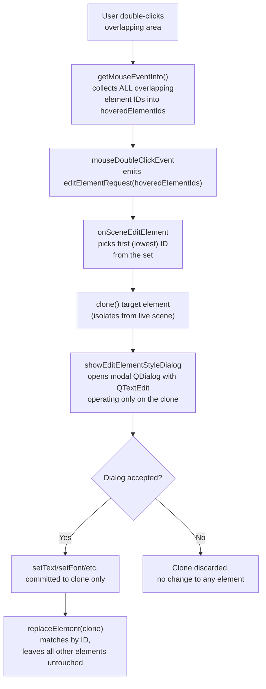

# DeepWiki Q&A with Code Context for Repository: JakubMelka/PDF4QT

若兩個文字框重疊，編輯一個文字框時，怎麼避免清除掉另一個文字框？
### Answer
## How PDF4QT Isolates Text Box Editing Among Overlapping Elements

The system uses several layered mechanisms working together to determine which text box is targeted and to prevent edits from "leaking" to other overlapping boxes.

---

### 1. Unique Element Identity via `m_elementId`

Every `PDFPageContentElement` (including `PDFPageContentElementTextBox`) carries a unique integer ID (`m_elementId`). When an element is added to the scene, it is assigned a monotonically increasing ID from `m_firstFreeId`. PDF4QT:363-368 

This ID is the sole key used to look up, select, and replace elements — never geometry or position.

---

### 2. Hit-Testing Collects ALL Overlapping Element IDs

`PDFPageContentScene::getMouseEventInfo()` iterates every element on the current page and calls `getManipulationMode()` for each one against the cursor position. For a `PDFPageContentElementTextBox`, `getManipulationMode` delegates to `getRectangleManipulationMode`, which returns non-zero for any point that falls within the rectangle or near its edges. PDF4QT:703-739 PDF4QT:2547-2551 PDF4QT:104-162 

All IDs of elements whose manipulation mode is non-zero are inserted into `info.hoveredElementIds` — meaning when boxes overlap, **all** overlapping boxes end up in this set simultaneously.

---

### 3. Editing Is Triggered by Double-Click on a Specific ID

`PDFPageContentScene::mouseDoubleClickEvent` fires the `editElementRequest` signal, passing the full set of hovered element IDs. PDF4QT:519-542 

In `EditorPlugin::onSceneEditElement`, the handler iterates this set and picks the **first valid element** — since `hoveredElementIds` is a `std::set<PDFInteger>` (ordered ascending), **the element with the lowest ID** (i.e., the one added to the scene first) is chosen when boxes overlap. PDF4QT:510-550 

---

### 4. Clone-Based Editing Isolates the Target Element

When an element is opened for editing, `onSceneEditElement` **clones** the target element. The modal dialog (`showEditElementStyleDialog`) operates entirely on this clone, not on the live scene element. PDF4QT:532-548 

For a `PDFPageContentElementTextBox`, the dialog populates a `QTextEdit` with the cloned element's text, font, alignment, and color. All text modifications (insertion, deletion) happen inside this isolated `QTextEdit` widget. PDF4QT:296-353 

There is no inline/cursor-based editing in the scene — `PDFPageContentElementTextBox` only exposes `getText()`/`setText()` as its text interface. PDF4QT:382-399 

---

### 5. `replaceElement` Updates Only the Matching ID

Upon dialog acceptance, the committed clone is written back via `m_scene.replaceElement(clonedElement.release())`. This method iterates the scene's element list and **only replaces the element whose `getElementId()` matches**, leaving all other overlapping elements completely untouched. PDF4QT:370-383 

---

### 6. Manipulation Also Scoped to Selected IDs Only

During drag-to-move/resize operations, `PDFPageContentElementManipulator::startManipulation` only clones elements that are in `m_selection` and only applies `performManipulation` offsets to those clones. Finishing the manipulation also uses `replaceElement` keyed by ID. PDF4QT:2238-2320 

---

### 7. Rendering Uses a Per-Element Clip Rect

During rendering, `PDFPageContentElementTextBox::drawPage` sets a clip rect to the element's own `m_rectangle` before drawing. This prevents any visual bleed-over into adjacent/overlapping boxes. PDF4QT:2475-2481 

---

### Summary Flow



---

### Notes

- When multiple boxes overlap at the double-click point, the system does **not** ask the user to disambiguate. It silently picks the element with the **lowest assigned ID** (first added to the scene), since `hoveredElementIds` is a `std::set<PDFInteger>` iterated in ascending order.
- There is no cursor/caret-based inline text editing at all for `PDFPageContentElementTextBox`. The only write path is through `setText()` called at dialog close, making it structurally impossible for a dialog editing one text box to affect another.
- The `PDFTextEditPseudowidget` (with `performInsertText`/`performDelete`) is an entirely separate system used for **AcroForm PDF form fields** and is not involved here.
### Citations
**File:** Pdf4QtLibWidgets/sources/pdfpagecontentelements.cpp (L104-162)
```cpp
uint PDFPageContentElement::getRectangleManipulationMode(const QRectF& rectangle,
                                                         const QPointF& point,
                                                         PDFReal snapPointDistanceThreshold) const
{
    if ((rectangle.topLeft() - point).manhattanLength() < snapPointDistanceThreshold)
    {
        return TopLeft;
    }

    if ((rectangle.topRight() - point).manhattanLength() < snapPointDistanceThreshold)
    {
        return TopRight;
    }

    if ((rectangle.bottomLeft() - point).manhattanLength() < snapPointDistanceThreshold)
    {
        return BottomLeft;
    }

    if ((rectangle.bottomRight() - point).manhattanLength() < snapPointDistanceThreshold)
    {
        return BottomRight;
    }

    if (rectangle.left() <= point.x() &&
        point.x() <= rectangle.right() &&
        (qAbs(rectangle.top() - point.y()) < snapPointDistanceThreshold))
    {
        return Top;
    }

    if (rectangle.left() <= point.x() &&
        point.x() <= rectangle.right() &&
        (qAbs(rectangle.bottom() - point.y()) < snapPointDistanceThreshold))
    {
        return Bottom;
    }

    if (rectangle.top() <= point.y() &&
        point.y() <= rectangle.bottom() &&
        (qAbs(rectangle.left() - point.x()) < snapPointDistanceThreshold))
    {
        return Left;
    }

    if (rectangle.top() <= point.y() &&
        point.y() <= rectangle.bottom() &&
        (qAbs(rectangle.right() - point.x()) < snapPointDistanceThreshold))
    {
        return Right;
    }

    if (rectangle.contains(point))
    {
        return Translate;
    }

    return None;
}
```
**File:** Pdf4QtLibWidgets/sources/pdfpagecontentelements.cpp (L363-368)
```cpp
void PDFPageContentScene::addElement(PDFPageContentElement* element)
{
    element->setElementId(m_firstFreeId++);
    m_elements.emplace_back(element);
    Q_EMIT sceneChanged(false);
}
```
**File:** Pdf4QtLibWidgets/sources/pdfpagecontentelements.cpp (L370-383)
```cpp
void PDFPageContentScene::replaceElement(PDFPageContentElement* element)
{
    std::unique_ptr<PDFPageContentElement> elementPtr(element);

    for (size_t i = 0; i < m_elements.size(); ++i)
    {
        if (m_elements[i]->getElementId() == element->getElementId())
        {
            m_elements[i] = std::move(elementPtr);
            Q_EMIT sceneChanged(false);
            break;
        }
    }
}
```
**File:** Pdf4QtLibWidgets/sources/pdfpagecontentelements.cpp (L519-542)
```cpp
void PDFPageContentScene::mouseDoubleClickEvent(QWidget* widget, QMouseEvent* event)
{
    Q_UNUSED(widget);

    if (!isActive())
    {
        return;
    }

    MouseEventInfo info = getMouseEventInfo(widget, event->pos());
    if (info.isValid())
    {
        Q_EMIT editElementRequest(info.hoveredElementIds);
    }

    // If mouse is grabbed, then event is accepted always (because
    // we get Press event, when we grabbed the mouse, then we will
    // wait for corresponding release event while all mouse move events
    // will be accepted, even if editor doesn't accept them.
    if (isMouseGrabbed())
    {
        event->accept();
    }
}
```
**File:** Pdf4QtLibWidgets/sources/pdfpagecontentelements.cpp (L703-739)
```cpp
PDFPageContentScene::MouseEventInfo PDFPageContentScene::getMouseEventInfo(QWidget* widget, QPoint point)
{
    MouseEventInfo result;

    Q_UNUSED(widget);
    Q_ASSERT(isActive());

    if (isMouseGrabbed())
    {
        result = m_mouseGrabInfo.info;
        result.widgetMouseCurrentPos = point;
        return result;
    }

    result.widgetMouseStartPos = point;
    result.widgetMouseCurrentPos = point;
    result.timer = m_mouseGrabInfo.info.timer;
    result.pageIndex = m_widget->getDrawWidgetProxy()->getPageUnderPoint(point, &result.pagePos);

    const PDFReal threshold = getSnapPointDistanceThreshold();
    for (const auto& elementItem : m_elements)
    {
        PDFPageContentElement* element = elementItem.get();

        if (element->getPageIndex() != result.pageIndex)
        {
            // Different page
            continue;
        }

        if (element->getManipulationMode(result.pagePos, threshold) != 0)
        {
            result.hoveredElementIds.insert(element->getElementId());
        }
    }

    return result;
```
**File:** Pdf4QtLibWidgets/sources/pdfpagecontentelements.cpp (L2238-2320)
```cpp
void PDFPageContentElementManipulator::startManipulation(PDFInteger pageIndex,
                                                         const QPointF& startPoint,
                                                         const QPointF& currentPoint,
                                                         PDFReal snapPointDistanceThreshold)
{
    Q_ASSERT(!isManipulationInProgress());

    // Collect elements to be manipulated
    for (const PDFInteger id : m_selection)
    {
        const PDFPageContentElement* element = m_scene->getElementById(id);

        if (!element || element->getPageIndex() != pageIndex)
        {
            continue;
        }

        uint manipulationMode = element->getManipulationMode(startPoint, snapPointDistanceThreshold);

        if (!manipulationMode)
        {
            manipulationMode = PDFPageContentElement::Translate;
        }

        // Jakub Melka: manipulate this element
        m_manipulatedElements.emplace_back(element->clone());
        m_manipulationModes[id] = manipulationMode;
    }

    if (!m_manipulatedElements.empty())
    {
        m_isManipulationInProgress = true;
        m_lastUpdatedPoint = startPoint;
        updateManipulation(pageIndex, startPoint, currentPoint);
        Q_EMIT stateChanged();
    }
}

void PDFPageContentElementManipulator::updateManipulation(PDFInteger pageIndex,
                                                          const QPointF& startPoint,
                                                          const QPointF& currentPoint)
{
    Q_UNUSED(startPoint);

    QPointF offset = currentPoint - m_lastUpdatedPoint;

    for (const auto& element : m_manipulatedElements)
    {
        if (element->getPageIndex() == pageIndex)
        {
            element->performManipulation(m_manipulationModes[element->getElementId()], offset);
        }
    }

    m_lastUpdatedPoint = currentPoint;
    Q_EMIT stateChanged();
}

void PDFPageContentElementManipulator::finishManipulation(PDFInteger pageIndex,
                                                          const QPointF& startPoint,
                                                          const QPointF& currentPoint,
                                                          bool createCopy)
{
    Q_ASSERT(isManipulationInProgress());
    updateManipulation(pageIndex, startPoint, currentPoint);

    if (createCopy)
    {
        for (const auto& element : m_manipulatedElements)
        {
            m_scene->addElement(element->clone());
        }
    }
    else
    {
        for (const auto& element : m_manipulatedElements)
        {
            m_scene->replaceElement(element->clone());
        }
    }

    cancelManipulation();
}
```
**File:** Pdf4QtLibWidgets/sources/pdfpagecontentelements.cpp (L2475-2481)
```cpp
    PDFPainterStateGuard guard(painter);
    painter->setWorldTransform(QTransform(pagePointToDevicePointMatrix), true);
    painter->setPen(convertor.convert(getPen()));
    painter->setBrush(convertor.convert(getBrush()));
    painter->setFont(font);
    painter->setRenderHint(QPainter::Antialiasing);
    painter->setClipRect(rect, Qt::IntersectClip);
```
**File:** Pdf4QtLibWidgets/sources/pdfpagecontentelements.cpp (L2547-2551)
```cpp
uint PDFPageContentElementTextBox::getManipulationMode(const QPointF& point,
                                                       PDFReal snapPointDistanceThreshold) const
{
    return getRectangleManipulationMode(getRectangle(), point, snapPointDistanceThreshold);
}
```
**File:** Pdf4QtEditorPlugins/EditorPlugin/editorplugin.cpp (L510-550)
```cpp
void EditorPlugin::onSceneEditElement(const std::set<pdf::PDFInteger>& elements)
{
    if (elements.empty())
    {
        return;
    }

    pdf::PDFPageContentElement* element = nullptr;
    for (pdf::PDFInteger id : elements)
    {
        element = m_scene.getElementById(id);
        if (element)
        {
            break;
        }
    }

    if (!element)
    {
        return;
    }

    std::unique_ptr<pdf::PDFPageContentElement> clonedElement(element->clone());
    if (pdf::PDFPageContentEditorStyleSettings::showEditElementStyleDialog(m_dataExchangeInterface->getMainWindow(), clonedElement.get()))
    {
        if (clonedElement->asElementEdited())
        {
            pdf::PDFPageContentElementEdited* editedElement = dynamic_cast<pdf::PDFPageContentElementEdited*>(clonedElement.get());
            if (editedElement->getElement()->asText())
            {
                if (!updateTextElement(editedElement))
                {
                    return;
                }
            }
        }

        m_scene.replaceElement(clonedElement.release());
        updateGraphics();
    }
}
```
**File:** Pdf4QtLibWidgets/sources/pdfpagecontenteditorstylesettings.cpp (L296-353)
```cpp
        QTextEdit* textEdit = nullptr;
        PDFPageContentStyledElement* styledElement = dynamic_cast<PDFPageContentStyledElement*>(element);
        PDFPageContentElementTextBox* textElement = dynamic_cast<PDFPageContentElementTextBox*>(element);

        if (textElement)
        {
            QGroupBox* contentGroupBox = new QGroupBox(&dialog);
            textEdit = new QTextEdit(textElement->getText(), contentGroupBox);
            textEdit->setFont(textElement->getFont());
            textEdit->setAlignment(textElement->getAlignment());
            textEdit->setTextColor(textElement->getPen().color());
            contentGroupBox->setTitle(tr("Content"));
            contentGroupBox->setLayout(new QVBoxLayout());
            contentGroupBox->layout()->addWidget(textEdit);
            dialog.layout()->addWidget(contentGroupBox);
        }

        appearanceWidget = new PDFPageContentEditorStyleSettings(&dialog);
        appearanceWidget->loadFromElement(element, true);

        if (textEdit)
        {
            connect(appearanceWidget, &PDFPageContentEditorStyleSettings::alignmentChanged, textEdit, &QTextEdit::setAlignment);
            connect(appearanceWidget, &PDFPageContentEditorStyleSettings::fontChanged, textEdit, &QTextEdit::setFont);
            connect(appearanceWidget, &PDFPageContentEditorStyleSettings::penChanged, textEdit, [textEdit](const QPen& pen) { textEdit->setTextColor(pen.color()); });
        }

        QGroupBox* appearanceGroupBox = new QGroupBox(&dialog);
        appearanceGroupBox->setTitle(tr("Appearance"));
        appearanceGroupBox->setLayout(new QVBoxLayout());
        appearanceGroupBox->layout()->addWidget(appearanceWidget);
        dialog.layout()->addWidget(appearanceGroupBox);

        QDialogButtonBox* dialogButtonBox = new QDialogButtonBox(QDialogButtonBox::Ok | QDialogButtonBox::Cancel, &dialog);
        connect(dialogButtonBox, &QDialogButtonBox::accepted, &dialog, &QDialog::accept);
        connect(dialogButtonBox, &QDialogButtonBox::rejected, &dialog, &QDialog::reject);
        dialog.layout()->addWidget(dialogButtonBox);

        pdf::PDFWidgetUtils::style(&dialog);

        if (dialog.exec() == QDialog::Accepted)
        {
            if (styledElement)
            {
                styledElement->setPen(appearanceWidget->getPen());
                styledElement->setBrush(appearanceWidget->getBrush());
            }

            if (textElement)
            {
                textElement->setText(textEdit->toPlainText());
                textElement->setFont(appearanceWidget->getFont());
                textElement->setAlignment(appearanceWidget->getAlignment());
                textElement->setAngle(appearanceWidget->getTextAngle());
            }

            return true;
        }
```
**File:** Pdf4QtLibWidgets/sources/pdfpagecontentelements.h (L382-399)
```text
    const QString& getText() const;
    void setText(const QString& newText);

    const QFont& getFont() const;
    void setFont(const QFont& newFont);

    PDFReal getAngle() const;
    void setAngle(PDFReal newAngle);

    const Qt::Alignment& getAlignment() const;
    void setAlignment(const Qt::Alignment& newAlignment);

private:
    QString m_text;
    QRectF m_rectangle;
    QFont m_font;
    PDFReal m_angle = 0.0;
    Qt::Alignment m_alignment = Qt::AlignCenter;
```