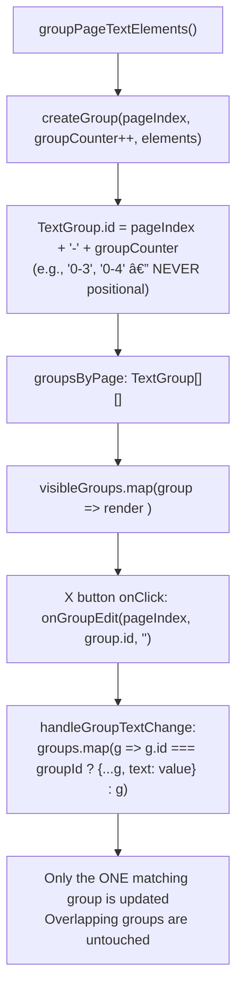

# DeepWiki Q&A with Code Context for Repository: Stirling-Tools/Stirling-PDF
## Q1
若兩個文字框é‡ç–Šï¼Œç·¨è¼¯ä¸€å€‹æ–‡å­—框時，怎麼é¿å…清除掉å¦ä¸€å€‹æ–‡å­—框？
### Answer
## 若兩個文字框é‡ç–Šï¼Œç·¨è¼¯ä¸€å€‹æ–‡å­—框時怎麼é¿å…清除å¦ä¸€å€‹

### é—œéµæ©Ÿåˆ¶ï¼šX 按鈕永é åªä½œç”¨æ–¼ç•¶å‰ä½œç”¨ä¸­çš„文字框

根據程å¼ç¢¼ï¼Œ**清除æ“作（X 按鈕）在設計上ä¸å¯èƒ½æ„外清除å¦ä¸€å€‹æ–‡å­—框**。

在 `PdfTextEditorView.tsx` çš„ `renderGroupContainer` 函å¼ä¸­ï¼Œç´…色的關閉按鈕（`ActionIcon`）**åªæœ‰åœ¨ `activeGroupId === groupId` 時æ‰æœƒé¡¯ç¤º**——也就是說，åŒä¸€æ™‚é–“åªæœ‰ä¸€å€‹æ–‡å­—框å¯ä»¥é¡¯ç¤º X 按鈕。 Stirling-PDF:1359-1404 

按鈕的 `onMouseDown` 事件中使用的 `groupId` 是渲染時從閉包（closure）æ•ç²çš„，**æ°¸é æŒ‡å‘當å‰ä½œç”¨ä¸­çš„文字框**：

- 如果文字為空 → å‘¼å« `onGroupDelete(pageIndex, groupId)` 刪除該文字框
- 如果文字有內容 → å‘¼å« `onGroupEdit(pageIndex, groupId, '')` 清除文字，但ä¿ç•™æ–‡å­—框

而 `handleGroupTextChange`ï¼ˆå³ `onGroupEdit` 的實作）åªæœƒæ›´æ–°åŒ¹é…該 `groupId` 的那一個群組，絕ä¸å½±éŸ¿å…¶ä»–群組： Stirling-PDF:769-777 

---

### 已知的 Z-index è¡çªå•é¡Œï¼ˆå¯èƒ½é€ æˆæ“作混淆）

雖然清除æ“作本身是安全的，但é‡ç–Šæ™‚存在一個 **z-index è¡çª**：

| 元素 | zIndex |
|------|--------|
| æ¯å€‹æ–‡å­—框容器（`containerStyle`） | `2_000_000` |
| X 關閉按鈕 | `9_999` |
| é¸å–工具列 | `3_000_000` | Stirling-PDF:2217-2232 Stirling-PDF:1363-1373 

由於相鄰文字框容器的 `zIndex`（`2_000_000`）é é«˜æ–¼ X 按鈕（`9_999`），當兩個文字框é‡ç–Šæ™‚，**ç›¸é„°æ–‡å­—æ¡†çš„å®¹å™¨æœƒåœ¨è¦–è¦ºä¸Šè“‹ä½ X 按鈕**，導致：

1. 你以為在點 A 文字框的 X 按鈕，å»å¯¦éš›ä¸Šé»žåˆ°äº† B 文字框的容器
2. 這會讓 B 文字框變æˆã€Œä½œç”¨ä¸­ã€ï¼ŒX 按鈕也隨之歸屬於 B
3. 此時如果å†æ¬¡é»ž X，清除的是 Bï¼Œè€Œéž A

---

### å¦ä¸€å€‹å·²çŸ¥çš„å° Bug

當 X 按鈕執行**清除文字**（文字有內容的分支）後，**沒有åŒæ™‚å°‡ `activeGroupId` å’Œ `editingGroupId` é‡è¨­ç‚º null**，導致文字框ä»è™•æ–¼ä½œç”¨ä¸­ç‹€æ…‹ã€X 按鈕繼續顯示。相比之下，「刪除文字框ã€çš„分支有正確地é‡è¨­é€™å…©å€‹ç‹€æ…‹ï¼š Stirling-PDF:1383-1394 

---

### 實用建議（如何在é‡ç–Šæƒ…æ³ä¸‹å®‰å…¨æ“作）

1. **切æ›è‡³ã€Œå–®è¡Œæ¨¡å¼ã€ï¼ˆSingle Line）**：
   在å³å´é¢æ¿çš„「Text Grouping Modeã€é¸æ“‡ `Single Line`，å¯ä»¥å¤§å¹…減少文字框é‡ç–Šçš„情æ³ã€‚ Stirling-PDF:1569-1578 

2. **先點擊空白處å†æ“作**：
   點擊é é¢èƒŒæ™¯ï¼ˆ`handleBackgroundClick`）å¯ä»¥å–消所有文字框的作用中狀態，é¿å… X 按鈕在錯誤時機出ç¾ã€‚ Stirling-PDF:1210-1215 

3. **啟用「Lock edited text to a single PDF elementã€é¸é …**：
   雖然主è¦å½±éŸ¿åŒ¯å‡ºå“質，但也å¯é¿å…匯出後字形é‡ç–Šçš„å•é¡Œã€‚ Stirling-PDF:1588-1605 

---

## Notes

- å°±**程å¼ç¢¼é‚輯**而言，X 按鈕**ä¸å¯èƒ½**清除「å¦ä¸€å€‹ã€æ–‡å­—框——因為 `groupId` 在閉包中是固定的。
- 真正的風險是：Z-index è¡çªå°Žè‡´ X 按鈕被相鄰文字框é®ä½ï¼Œä½¿ç”¨è€…å¯èƒ½èª¤é»žåˆ°ç›¸é„°æ–‡å­—框，讓它æˆç‚ºã€Œä½œç”¨ä¸­ã€ï¼Œä¹‹å¾Œå†é»ž X 就清除了那個相鄰框。
- 根本的修復方å¼æ‡‰æ˜¯å°‡ X 按鈕的 `zIndex` æ高到 `2_000_000` 以上（例如與é¸å–工具列一樣使用 `3_000_000`），使其永é å¯é»žæ“Šã€‚
### Citations
**File:** frontend/src/core/components/tools/pdfTextEditor/PdfTextEditorView.tsx (L1210-1215)
```typescript
  const handleBackgroundClick = () => {
    setEditingGroupId(null);
    setActiveGroupId(null);
    setActiveImageId(null);
    clearSelection();
  };
```
**File:** frontend/src/core/components/tools/pdfTextEditor/PdfTextEditorView.tsx (L1359-1404)
```typescript
      {activeGroupId === groupId && (
        <ActionIcon
          size="xs"
          variant="filled"
          color="red"
          radius="xl"
          style={{
            position: 'absolute',
            top: -8,
            right: -8,
            zIndex: 9999,
            cursor: 'pointer',
            pointerEvents: 'auto',
          }}
          onMouseDown={(event) => {
            console.log(`⌠MOUSEDOWN on X button for group ${groupId}`);
            event.stopPropagation();
            event.preventDefault();

            // Find the current group to check if it's already empty
            const currentGroups = groupsByPage[pageIndex] ?? [];
            const currentGroup = currentGroups.find(g => g.id === groupId);
            const currentText = (currentGroup?.text ?? '').trim();

            if (currentText.length === 0) {
              // Already empty - remove the textbox entirely
              console.log(`   Text already empty, removing textbox`);
              onGroupDelete(pageIndex, groupId);
              setActiveGroupId(null);
              setEditingGroupId(null);
            } else {
              // Has text - clear it but keep the textbox
              console.log(`   Clearing text (textbox remains)`);
              onGroupEdit(pageIndex, groupId, '');
            }
            console.log(`   Operation completed`);
          }}
          onClick={(event) => {
            console.log(`⌠X button ONCLICK fired for group ${groupId} on page ${pageIndex}`);
            event.stopPropagation();
            event.preventDefault();
          }}
        >
          <CloseIcon style={{ fontSize: 12 }} />
        </ActionIcon>
      )}
```
**File:** frontend/src/core/components/tools/pdfTextEditor/PdfTextEditorView.tsx (L1569-1578)
```typescript
              <SegmentedControl
                value={externalGroupingMode}
                onChange={(value) => handleModeChangeRequest(value as GroupingMode)}
                data={[
                  { label: t('pdfTextEditor.groupingMode.auto', 'Auto'), value: 'auto' },
                  { label: t('pdfTextEditor.groupingMode.paragraph', 'Paragraph'), value: 'paragraph' },
                  { label: t('pdfTextEditor.groupingMode.singleLine', 'Single Line'), value: 'singleLine' },
                ]}
                fullWidth
              />
```
**File:** frontend/src/core/components/tools/pdfTextEditor/PdfTextEditorView.tsx (L1588-1605)
```typescript
            <Group justify="space-between" align="center">
              <div>
                <Text fw={500} size="sm">
                  {t('pdfTextEditor.options.forceSingleElement.title', 'Lock edited text to a single PDF element')}
                </Text>
                <Text size="xs" c="dimmed" mt={4}>
                  {t(
                    'pdfTextEditor.options.forceSingleElement.description',
                    'When enabled, the editor exports each edited text box as one PDF text element to avoid overlapping glyphs or mixed fonts.'
                  )}
                </Text>
              </div>
              <Switch
                size="md"
                checked={forceSingleTextElement}
                onChange={(event) => onForceSingleTextElementChange(event.currentTarget.checked)}
              />
            </Group>
```
**File:** frontend/src/core/components/tools/pdfTextEditor/PdfTextEditorView.tsx (L2217-2232)
```typescript
                      const containerStyle: React.CSSProperties = {
                        position: 'absolute',
                        left: `${containerLeft}px`,
                        top: `${containerTop}px`,
                        width: `${containerWidth + WRAPPER_HORIZONTAL_PADDING}px`,
                        height: useFlexibleHeight ? 'auto' : `${containerHeight}px`,
                        minHeight: useFlexibleHeight ? 'auto' : `${containerHeight}px`,
                        display: 'flex',
                        alignItems: 'flex-start',
                        justifyContent: 'flex-start',
                        pointerEvents: 'auto',
                        cursor: 'text',
                        zIndex: 2_000_000,
                        transform,
                        transformOrigin,
                      };
```
**File:** frontend/src/core/tools/pdfTextEditor/PdfTextEditor.tsx (L769-777)
```typescript
  const handleGroupTextChange = useCallback((pageIndex: number, groupId: string, value: string) => {
    setGroupsByPage((previous) =>
      previous.map((groups, idx) =>
        idx !== pageIndex
          ? groups
          : groups.map((group) => (group.id === groupId ? { ...group, text: value } : group))
      )
    );
  }, []);
```
## Q2
ä¸ç®¡åˆ†å¹¾å€‹æ–‡å­—框，原ç†ä¸Šæ–‡å­—都åªæ˜¯æ”¾ç½®åœ¨PDF上的指定ä½ç½®ï¼Œåœ¨æ¸…除其中一個文字框時，若清除掉一個文字框上所有ä½ç½®çš„文字，就會刪到åŒæ¨£ä½ç½®çš„ä¸åŒæ–‡å­—框文字。此專案如何é¿å…這一點？
### Answer
## How Individual Text Boxes/Groups Are Stored and Identified

The PDF text editor uses a **unique, counter-based `id` string** on each `TextGroup` object as the primary key to isolate all operations to a single text box, regardless of its physical position on the page.

---

### 1. The `TextGroup` Type Definition

Every text box is represented as a `TextGroup` object with an `id: string` field. This `id` is completely independent of the group's spatial `bounds`. Stirling-PDF:154-174 

---

### 2. How the `id` Is Generated (Counter-Based, Not Position-Based)

Inside `groupPageTextElements`, a monotonically incrementing `groupCounter` is used. Each time a new group is created via `createGroup`, the counter is passed as `idSuffix`, and the resulting id is formatted as `"${pageIndex}-${idSuffix}"`. This means two groups occupying the **exact same physical position** will have **different IDs** (e.g., `"0-3"` vs `"0-4"`), because id assignment is purely sequential. Stirling-PDF:488-521 Stirling-PDF:772-829 

When paragraph groups are merged from multiple lines, the merged group deliberately **keeps the first line's `id`** to preserve identity continuity: Stirling-PDF:710-731 

---

### 3. How Edits Are Scoped to a Single Group by `id`

`handleGroupTextChange` in `PdfTextEditor.tsx` uses `group.id === groupId` as the predicate when mapping over all groups on a page. Only the one group whose `id` matches the passed `groupId` gets the new text value. All other groups (including any at the same physical position) are returned unchanged. Stirling-PDF:769-777 

Similarly, `handleGroupDelete` filters using `group.id !== groupId`, ensuring only the specifically targeted group is removed: Stirling-PDF:779-790 

---

### 4. The "Clear/Delete" Button in the UI Passes the Specific `groupId`

In `renderGroupContainer`, the "×" (CloseIcon) button's `onMouseDown` handler explicitly receives `groupId` via closure over the render loop variable and calls `onGroupEdit(pageIndex, groupId, '')` or `onGroupDelete(pageIndex, groupId)` using that exact id. Since each rendered box closes over its own `group.id`, clicking the X on one box will never affect another overlapping box. Stirling-PDF:1373-1405 

---

### 5. All UI State Is Also Keyed by `group.id`

Active/editing state, width overrides, text scale, and caret offset tracking are all stored in Maps keyed by `group.id`: Stirling-PDF:321-346 

DOM elements are also annotated with `data-text-group={group.id}` and `data-editor-group={group.id}` attributes so that DOM queries target only the specific group: Stirling-PDF:2263-2282 Stirling-PDF:2349-2387 

---

### Summary Diagram



---

### Notes

- The `id` is **never derived from position** (`bounds.left`, `bounds.top`, etc.). It is purely an ordinal counter, so two groups at identical physical coordinates will always have distinct IDs.
- When `splitParagraphGroup` splits a paragraph back into lines, each new sub-group gets a fresh id incorporating `Date.now()` to guarantee uniqueness: Stirling-PDF:184-199 
- The `originalText` field on each `TextGroup` serves as a second safeguard: `buildUpdatedDocument` and `restoreGlyphElements` only replace the PDF elements of a group if `group.text !== group.originalText`, further preventing unintended mutation of non-edited groups. Stirling-PDF:1200-1215
### Citations
**File:** frontend/src/core/tools/pdfTextEditor/pdfTextEditorTypes.ts (L154-174)
```typescript
export interface TextGroup {
  id: string;
  pageIndex: number;
  fontId?: string | null;
  fontSize?: number | null;
  fontMatrixSize?: number | null;
  lineSpacing?: number | null;
  lineElementCounts?: number[] | null;
  color?: string | null;
  fontWeight?: number | 'normal' | 'bold' | null;
  rotation?: number | null;
  anchor?: { x: number; y: number } | null;
  baselineLength?: number | null;
  baseline?: number | null;
  elements: PdfJsonTextElement[];
  originalElements: PdfJsonTextElement[];
  text: string;
  originalText: string;
  bounds: BoundingBox;
  childLineGroups?: TextGroup[] | null;
}
```
**File:** frontend/src/core/tools/pdfTextEditor/pdfTextEditorUtils.ts (L488-521)
```typescript
const createGroup = (
  pageIndex: number,
  idSuffix: number,
  elements: PdfJsonTextElement[],
  metrics?: FontMetricsMap,
): TextGroup => {
  const clones = elements.map(cloneTextElement);
  const originalClones = clones.map(cloneTextElement);
  const bounds = mergeBounds(elements.map((element) => getElementBounds(element, metrics)));
  const firstElement = elements[0];
  const rotation = computeGroupRotation(elements);
  const anchor = rotation !== null ? getAnchorPoint(firstElement) : null;
  const baselineLength = computeBaselineLength(elements, metrics);
  const baseline = computeAverageBaseline(elements);

  return {
    id: `${pageIndex}-${idSuffix}`,
    pageIndex,
    fontId: firstElement?.fontId,
    fontSize: firstElement?.fontSize,
    fontMatrixSize: firstElement?.fontMatrixSize,
    color: firstElement ? extractColor(firstElement) : null,
    fontWeight: null, // Will be determined from font descriptor
    rotation,
    anchor,
    baselineLength,
    baseline,
    elements: clones,
    originalElements: originalClones,
    text: buildGroupText(elements, metrics),
    originalText: buildGroupText(elements, metrics),
    bounds,
  };
};
```
**File:** frontend/src/core/tools/pdfTextEditor/pdfTextEditorUtils.ts (L710-731)
```typescript
    return {
      id: lines[0].id, // Keep the first line's ID
      pageIndex,
      fontId: firstElement?.fontId,
      fontSize: firstElement?.fontSize,
      fontMatrixSize: firstElement?.fontMatrixSize,
      lineSpacing: averageSpacing,
      lineElementCounts: lines.length > 1 ? lineElementCounts : null,
      color: firstElement ? extractColor(firstElement) : null,
      fontWeight: null,
      rotation,
      anchor,
      baselineLength,
      baseline,
      elements: allElements.map(cloneTextElement),
      originalElements: allElements.map(cloneTextElement),
      text: paragraphText,
      originalText: paragraphText,
      bounds: mergedBounds,
      childLineGroups: allLines,
    };
  });
```
**File:** frontend/src/core/tools/pdfTextEditor/pdfTextEditorUtils.ts (L772-829)
```typescript
  let groupCounter = 0;
  const lineGroups: TextGroup[] = [];

  lines.forEach((line) => {
    let currentBucket: PdfJsonTextElement[] = [];

    line.elements.forEach((element) => {
      if (currentBucket.length === 0) {
        currentBucket.push(element);
        return;
      }

      const previous = currentBucket[currentBucket.length - 1];
      const gap = getX(element) - (getX(previous) + getWidth(previous, metrics));
      const avgFontSize = (getFontSize(previous) + getFontSize(element)) / 2;
      const splitThreshold = Math.max(SPACE_MIN_GAP, avgFontSize * GAP_FACTOR);

      const sameFont = previous.fontId === element.fontId;
      let shouldSplit = gap > splitThreshold * (sameFont ? 1.4 : 1.0);

      if (shouldSplit) {
        const prevBaseline = getBaseline(previous);
        const currentBaseline = getBaseline(element);
        const baselineDelta = Math.abs(prevBaseline - currentBaseline);
        const prevEndX = getX(previous) + getWidth(previous, metrics);
        const _prevEndY = prevBaseline;
        const diagonalGap = Math.hypot(Math.max(0, getX(element) - prevEndX), baselineDelta);
        const diagonalThreshold = Math.max(avgFontSize * 0.8, splitThreshold);
        if (diagonalGap <= diagonalThreshold) {
          shouldSplit = false;
        }
      }

      const previousRotation = extractElementRotation(previous);
      const currentRotation = extractElementRotation(element);
      if (
        shouldSplit &&
        previousRotation !== null &&
        currentRotation !== null &&
        Math.abs(normalizeAngle(previousRotation - currentRotation)) < 1
      ) {
        shouldSplit = false;
      }

      if (shouldSplit) {
        lineGroups.push(createGroup(pageIndex, groupCounter, currentBucket, metrics));
        groupCounter += 1;
        currentBucket = [element];
      } else {
        currentBucket.push(element);
      }
    });

    if (currentBucket.length > 0) {
      lineGroups.push(createGroup(pageIndex, groupCounter, currentBucket, metrics));
      groupCounter += 1;
    }
  });
```
**File:** frontend/src/core/tools/pdfTextEditor/pdfTextEditorUtils.ts (L1200-1215)
```typescript

    const updatedElements: PdfJsonTextElement[] = groups.flatMap((group) => {
      if (group.text === group.originalText) {
        return group.originalElements.map(cloneTextElement);
      }
      return [createMergedElement(group)];
    });

    return {
      ...page,
      textElements: updatedElements,
      imageElements: images.map(cloneImageElement),
      contentStreams: page.contentStreams ?? [],
    };
  });

```
**File:** frontend/src/core/tools/pdfTextEditor/PdfTextEditor.tsx (L184-199)
```typescript
  return templateLines.map((template, index) => {
    const take = Math.max(1, baseCounts[index] ?? 1);
    const slice = group.originalElements.slice(offset, offset + take).map(cloneTextElement);
    offset += take;
    return {
      ...template,
      id: `${group.id}-line-${index + 1}-${Date.now()}-${index}`,
      text: textLines[index] ?? '',
      originalText: originalLines[index] ?? '',
      elements: slice.map(cloneTextElement),
      originalElements: slice,
      lineElementCounts: null,
      lineSpacing: null,
      childLineGroups: null,
    };
  });
```
**File:** frontend/src/core/tools/pdfTextEditor/PdfTextEditor.tsx (L769-777)
```typescript
  const handleGroupTextChange = useCallback((pageIndex: number, groupId: string, value: string) => {
    setGroupsByPage((previous) =>
      previous.map((groups, idx) =>
        idx !== pageIndex
          ? groups
          : groups.map((group) => (group.id === groupId ? { ...group, text: value } : group))
      )
    );
  }, []);
```
**File:** frontend/src/core/tools/pdfTextEditor/PdfTextEditor.tsx (L779-790)
```typescript
  const handleGroupDelete = useCallback((pageIndex: number, groupId: string) => {
    console.log(`ðŸ—‘ï¸ Deleting group ${groupId} from page ${pageIndex}`);
    setGroupsByPage((previous) => {
      const updated = previous.map((groups, idx) => {
        if (idx !== pageIndex) return groups;
        const filtered = groups.filter((group) => group.id !== groupId);
        console.log(`   Before: ${groups.length} groups, After: ${filtered.length} groups`);
        return filtered;
      });
      return updated;
    });
  }, []);
```
**File:** frontend/src/core/components/tools/pdfTextEditor/PdfTextEditorView.tsx (L321-346)
```typescript
  const [activeGroupId, setActiveGroupId] = useState<string | null>(null);
  const [editingGroupId, setEditingGroupId] = useState<string | null>(null);
  const [activeImageId, setActiveImageId] = useState<string | null>(null);
  const [selectedGroupIds, setSelectedGroupIds] = useState<Set<string>>(new Set());
  const [widthOverrides, setWidthOverrides] = useState<Map<string, number>>(new Map());
  const draggingImageRef = useRef<string | null>(null);
  const rndRefs = useRef<Map<string, any>>(new Map());
  const pendingDragUpdateRef = useRef<number | null>(null);
  const [fontFamilies, setFontFamilies] = useState<Map<string, string>>(new Map());
  const [autoScaleText, setAutoScaleText] = useState(true);
  const [textScales, setTextScales] = useState<Map<string, number>>(new Map());
  const [pendingModeChange, setPendingModeChange] = useState<GroupingMode | null>(null);
  const measurementKeyRef = useRef<string>('');
  const containerRef = useRef<HTMLDivElement | null>(null);
  const editorRefs = useRef<Map<string, HTMLDivElement>>(new Map());
  const caretOffsetsRef = useRef<Map<string, number>>(new Map());
  const lastSelectedGroupIdRef = useRef<string | null>(null);
  const widthOverridesRef = useRef<Map<string, number>>(widthOverrides);
  const resizingRef = useRef<{
    groupId: string;
    startX: number;
    startWidth: number;
    baseWidth: number;
    maxWidth: number;
  } | null>(null);

```
**File:** frontend/src/core/components/tools/pdfTextEditor/PdfTextEditorView.tsx (L1373-1405)
```typescript
          onMouseDown={(event) => {
            console.log(`⌠MOUSEDOWN on X button for group ${groupId}`);
            event.stopPropagation();
            event.preventDefault();

            // Find the current group to check if it's already empty
            const currentGroups = groupsByPage[pageIndex] ?? [];
            const currentGroup = currentGroups.find(g => g.id === groupId);
            const currentText = (currentGroup?.text ?? '').trim();

            if (currentText.length === 0) {
              // Already empty - remove the textbox entirely
              console.log(`   Text already empty, removing textbox`);
              onGroupDelete(pageIndex, groupId);
              setActiveGroupId(null);
              setEditingGroupId(null);
            } else {
              // Has text - clear it but keep the textbox
              console.log(`   Clearing text (textbox remains)`);
              onGroupEdit(pageIndex, groupId, '');
            }
            console.log(`   Operation completed`);
          }}
          onClick={(event) => {
            console.log(`⌠X button ONCLICK fired for group ${groupId} on page ${pageIndex}`);
            event.stopPropagation();
            event.preventDefault();
          }}
        >
          <CloseIcon style={{ fontSize: 12 }} />
        </ActionIcon>
      )}
    </Box>
```
**File:** frontend/src/core/components/tools/pdfTextEditor/PdfTextEditorView.tsx (L2263-2282)
```typescript
                      if (isEditing) {
                        return (
                          <Box key={group.id} style={containerStyle}>
                            {renderGroupContainer(
                              group.id,
                              group.pageIndex,
                              true,
                              changed,
                              <div
                                ref={(node) => {
                                  if (node) {
                                    editorRefs.current.set(group.id, node);
                                  } else {
                                    editorRefs.current.delete(group.id);
                                  }
                                }}
                                contentEditable
                                suppressContentEditableWarning
                                data-editor-group={group.id}
                                onFocus={(event) => {
```
**File:** frontend/src/core/components/tools/pdfTextEditor/PdfTextEditorView.tsx (L2349-2387)
```typescript
                      return (
                        <Box key={group.id} style={containerStyle}>
                          {renderGroupContainer(
                            group.id,
                            group.pageIndex,
                            isActive,
                            changed,
                            <div
                              data-text-group={group.id}
                              style={{
                                width: '100%',
                                minHeight: '100%',
                                padding: '2px',
                                whiteSpace,
                                wordBreak,
                                overflowWrap,
                                fontSize: `${fontSizePx}px`,
                                fontFamily,
                                fontWeight,
                                lineHeight: lineHeightRatio,
                                color: textColor,
                                display: 'block',
                                cursor: 'text',
                                overflow: enableWrap ? 'visible' : 'hidden',
                              }}
                            >
                              <span
                                data-text-content
                                style={{
                                  pointerEvents: 'none',
                                  display: enableWrap ? 'inline' : 'inline-block',
                                  transform: shouldScale ? `scaleX(${textScale})` : 'none',
                                  transformOrigin: 'left center',
                                  whiteSpace,
                                }}
                              >
                                {group.text || '\u00A0'}
                              </span>
                            </div>,
```