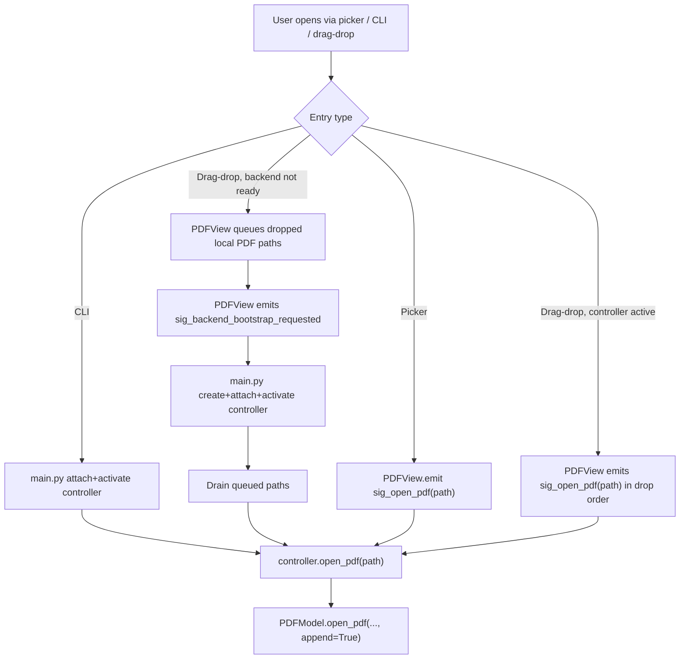
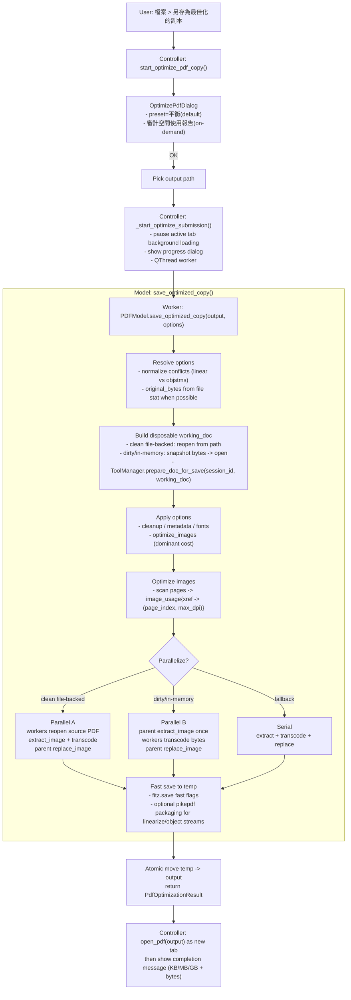

# PDF Editor Architecture

## 1. Overview

The project uses MVC with built-in tool extensions.

```text
+-------------------+         signals          +---------------------+
|       View        | -----------------------> |     Controller      |
| (Qt widgets/UI)   | <----------------------- | (flow coordination) |
+-------------------+        updates           +----------+----------+
                                                       calls |
                                                             v
                                                +------------+------------+
                                                |          Model          |
                                                | (docs, sessions, edits) |
                                                +------------+------------+
                                                             |
                                               delegates     |
                                                             v
                                                +------------+------------+
                                                |       ToolManager       |
                                                | annotation/watermark/   |
                                                | search/ocr extensions   |
                                                +-------------------------+
```

Entry wiring happens in `main.py`. CLI-open startup instantiates `PDFModel`, `PDFView`, and `PDFController` immediately; empty startup instantiates only `PDFView` until a document is requested.
Application-level logging configuration is also owned by `main.py`; importable modules only acquire named loggers and do not call `logging.basicConfig(...)` at import time. Some modules may still apply narrow logger-level adjustments for extremely noisy third-party debug channels (for example PIL PNG chunk parsing).
For empty startup (no CLI PDF paths), `main.py` shows `PDFView` first and defers backend creation. When the user requests a document (open or drop), the view queues paths and emits `sig_backend_bootstrap_requested`; `main.py` then creates model/controller, attaches/activates them, and drains queued open paths. Direct CLI-open startup keeps the synchronous attach/activate/open path.
The CLI entry point in `main.py` now has an `argparse` surface: positional PDF paths open as tabs, `--merge OUTPUT <inputs...>` runs a headless `fitz`-only merge and exits before Qt widget bootstrap, and real app launches use a per-user single-instance bridge (`QLocalServer` / `QLocalSocket`) so later invocations forward file paths into the already-running window instead of spawning duplicate editor windows.

App identity is **CyberSagaPDF** (org `CyberSaga`): `main.py` sets the Windows AppUserModelID (`CyberSaga.CyberSagaPDF`) and the application icon (`view/icons.py:load_app_icon` → `appearance_design/app_icon.ico`); `utils/preferences.py` stores QSettings under `CyberSaga/CyberSagaPDF` and migrates each known key from the legacy `pdf_editor` namespace when it is missing in the new store; `utils/single_instance.py` probes the legacy `pdf_editor_singleinstance_*` server name as a fallback so a new build still forwards into an older running instance. Optional Windows `.pdf` association is handled by `scripts/windows_file_association.ps1` (HKCU-only, snapshot/rollback, never touches the protected UserChoice). The identity strings are currently hardcoded per-site — consolidation into a `utils/app_identity.py` leaf is tracked in `TODOS.md`.

## 2. Layer Responsibilities

### 2.1 Model (`model/pdf_model.py`)

Model owns document correctness and persistence behavior. It manages sessions (`DocumentSession`), document handles (`fitz.Document`), text hit-testing, text edit transactions, add-text insertion, save/save-as pipeline, and snapshot helpers used by history commands.

Important text APIs include `get_text_info_at_point(...)`, `edit_text(...)`, `add_textbox(...)`, and `set_text_target_mode(...)`.
The text rendering path now resolves style tokens and supports custom CJK-family embedding for insert-html flows (for example `microsoft jhenghei`, `pmingliu`, `dfkai-sb`) when local font files are available.
Browse-mode selection is also model-owned: legacy rectangle helpers still exist, but the primary browse drag path now uses a run-anchored resolver. Mouse-down locks the start run, mouse-up resolves the end run, boundary lines stay partial, and only the fully covered lines between them expand to whole-line units. `get_text_info_at_point(...)` now has a strict-hit option (`allow_fallback=False`) so browse selection can reject coarse block fallback hits while other flows keep backward-compatible text-block behavior.
Object manipulation correctness is also model-owned. App-owned textboxes/rectangles/images still use hidden annotation markers for identity, while native PDF images are discovered from parsed page content stream operators. Their primary bbox/rotation data comes from the parsed `cm` transform, with per-xref placement APIs only used as a fallback when a safe `cm` is unavailable. Native-image move/resize/rotate/delete rewrites the target image invocation operators instead of redacting the painted bbox, so overlapping text/graphics are preserved.

Snapshot APIs include `_capture_doc_snapshot()`, `_restore_doc_from_snapshot(...)`, `_capture_page_snapshot(...)`, `_capture_page_snapshot_strict(...)`, and `_restore_page_from_snapshot(...)`.
`build_print_snapshot(dest: Path) -> None` (delegating to `ToolManager.build_print_snapshot(dest)`) writes the print-input PDF directly to a destination path instead of returning bytes, so the print path never holds a full serialized copy of the document in memory. The former `capture_print_input_pdf_bytes()` helper was removed with this change (the print submission worker was its only caller).

#### Transactional Text Editing Phases (Helper Boundaries)

`PDFModel.edit_text(...)` is implemented as a transactional pipeline and is structured into independently testable helper phases:

- Target-mode resolution: `_resolve_effective_target_mode(...)`
- Phase 1 (resolve): `_resolve_edit_target(...)`
- Phase 2 (mutate): `_apply_redact_insert(...)`
- Phase 3 (verify + index): `_verify_rebuild_edit(...)`
- Horizontal single-line edits that still fit on one line use an origin-preserving `insert_text(...)` fast path inside `_apply_redact_insert(...)`; wrapped / dragged / vertical cases still use the existing htmlbox flow.
- Paragraph-mode edits that span ≥2 distinct span colors use `_build_multi_style_html(...)` (difflib char-level mapping) to rebuild per-run color fidelity. This path is gated on `preserve_multi_style` and takes priority over the single-line fast path.

This structure is enforced by per-phase unit tests using real PyMuPDF documents (no mocks) in `test_scripts/test_edit_text_helpers.py`.

#### Structural Page Operations and Text Indexing

Structural operations (insert/delete pages) are model-owned correctness logic. The model must sanitize dirty inputs and return the actual effected pages so the controller can synchronize UI and undo metadata without re-deriving page numbers.

Key contracts:
- `delete_pages(pages) -> list[int]` returns the actual deleted pages (1-based, sorted).
- `insert_blank_page(position) -> list[int]` returns the actual inserted page number (1-based).
- `insert_pages_from_file(source_file, source_pages, position) -> list[int]` returns the actual inserted target page numbers (1-based, sorted).

Text index lifecycle:
- Page text indices live in `TextBlockManager` ([`model/text_block.py`](../model/text_block.py)).
- Each cached page has a state: `"missing" | "clean" | "stale"`.
- Structural ops shift cached keys and mark shifted pages `"stale"` (cheap), instead of eagerly rebuilding the entire document.
- Any immediate edit/search path calls `model.ensure_page_index_built(page_num)` which rebuilds missing/stale pages on-demand.

### 2.2 Commands (`model/edit_commands.py`)

Command classes define history boundaries:
- `EditTextCommand` for existing text edits.
- `AddTextboxCommand` for atomic add-text insertion.
- `SnapshotCommand` for document-level structural operations.
- `CommandManager` for undo/redo stacks.

`EditTextCommand` now carries an `EditTextResult` outcome (`success`, `no_change`, `target_block_not_found`, `target_span_not_found`). When execution does not succeed, `CommandManager.execute()` / redo skip undo-stack recording for that command instead of creating a no-op history entry.
`AddTextboxCommand` stores strict before-page snapshots, captures after-page snapshots on first execute, and restores only the target page on undo/redo.

Undo-stack memory budget: in addition to the count cap (`MAX_UNDO_STACK_SIZE = 100`), `CommandManager` enforces `MAX_UNDO_STACK_BYTES = 512 MiB` over the sum of each command's `_byte_size()` (snapshot payload bytes; base `EditCommand` reports 0). `_trim_undo_stack_if_needed()` evicts oldest commands first and decrements `_saved_stack_size` per eviction (clamped at 0) so `has_pending_changes()` stays correct. After every push (execute/record/redo), `_dedup_top_snapshot_pair()` shares a single `bytes` object between two adjacent `SnapshotCommand`s whose `after`/`before` boundary snapshots are equal — safe because `bytes` is immutable and `_restore_doc_from_snapshot` copies on `fitz.open("pdf", ...)`.

### 2.3 Controller (`controller/pdf_controller.py`)

Controller is the only mutation coordinator between View and Model. It normalizes mode transitions, creates/executes commands, controls refresh scopes, and preserves per-session UI state.
Document-tab refresh also synchronizes the active session's Save As suggestion into the view, so the view-owned `另存PDF` dialog opens with the current tab's path/name instead of a blank or stale filename.

Mode registry includes `browse`, `edit_text`, `add_text`, `rect`, `highlight`, and `add_annotation`.

Controller activation is now explicit. `PDFController.__init__()` keeps startup cheap, while `PDFController.activate()` performs view-signal wiring, print subsystem setup, and startup sync such as text-target granularity alignment. This keeps the no-document startup shell decoupled from full controller behavior until the UI is ready.

For performance on large PDFs, controller schedules heavy work in small batches (thumbnail rasterization, visible-page rendering, and text indexing). Continuous mode now uses a placeholder-first pipeline: the view allocates full-document scene geometry immediately from lightweight placeholders, then the controller progressively renders only the viewport window (plus a small prefetch margin) so the UI stays interactive even on 1000+ page PDFs. Open-time priority is now explicit: the initial visible page is allowed to reach high quality before background thumbnail batches and sidebar scans start, with a short fallback timer so background work still resumes if that high-quality upgrade never arrives. After structural operations or snapshot restore, controller also drains stale page indices in the background (`_schedule_stale_index_drain`), while the active/visible pages remain immediately usable via the model's `ensure_page_index_built(...)` contract.

### 2.4 View (`view/pdf_view.py`)

View owns widgets, scene interactions, and signal emission. It does not mutate model business state directly.
For empty startup it can show a lightweight shell with no model/controller attached. When the user requests a document (open or drop), the view queues paths and emits a backend-bootstrap signal so `main.py` can create model/controller and drain pending open paths.
The view also owns the Save As dialog invocation (`_save_as()`), but the controller supplies the active-session default path through `set_save_as_default_path(...)`.

Continuous mode rendering contracts:
- `initialize_continuous_placeholders(...)` establishes the full scene rect and per-page y offsets for the entire document without rasterizing every page.
- The view emits `sig_viewport_changed` when the user scrolls/resizes; the controller uses this as the steady-state trigger to schedule visible-page rendering.
- Programmatic jumps (for example controller-driven navigation) may suppress `sig_viewport_changed` emissions to avoid double-scheduling the same visible render batch.
- Visible-render scheduling is controller-owned and now coalesced per session. Repeated page changes or viewport notifications may update the target page immediately, but they must not keep spawning fresh render generations while a batch is already queued.
- Thumbnail layout metrics are view-owned; when the left sidebar becomes unusually wide, the thumbnail column caps its content width and uses symmetric viewport margins so thumbnails stay centered instead of stretching indefinitely.

The text editor state is split by intent:
- `edit_existing` for updating existing text.
- `add_new` for inserting new page text.
- Browse-mode drag selection still starts in the view, but the actual copied text and highlight bounds are resolved through the model's run-anchored selection helpers so the MVC boundary stays intact. Start requires a direct run hit via strict hit-testing (`allow_fallback=False`); the end point may snap to the nearest run on the same page only after exact-run hit detection misses.

Typed edit payloads are part of the view/controller boundary and are defined in `model/edit_requests.py` (single source of truth):
- `EditTextRequest` packages same-page edit commits.
- `MoveTextRequest` packages cross-page text moves and replaces the previous positional `sig_move_text_across_pages(...)` signature.
Both are re-exported via `view/text_editing.py` for backward-compatible view/controller imports.

Inline editor finalization is guarded by focus context:
- Focus transitions inside text-edit context (editor widget, text property panel, combo popups) keep the session alive.
- Focus transitions outside the edit context finalize the current inline editor.
- A short deferred check avoids false finalize during Qt popup handoff.

Text style controls include explicit commit/cancel buttons:
- `套用` commits current inline edit.
- `取消` discards current inline edit session changes.

Mode behavior boundary:
- In `edit_text`, blank-click does not create new textbox. All visible selectable text targets are drawn as persistent outlines (`_draw_all_block_outlines`) so users can see editable zones without hovering. In `run` mode the outlines follow run boxes; in `paragraph` mode they follow paragraph boxes instead of coarse block rectangles.
- Outline redraws driven by scroll and zoom are debounced through `_schedule_outline_redraw()` (80 ms single-shot timer) so rapid viewport events collapse to one redraw instead of rebuilding 30 to 90 `QGraphicsRectItem`s on every tick.
- When the selected text target is rotated (`90/180/270`), the inline editor proxy is laid out with rotation-aware geometry and the proxy itself is rotated, so the editor content matches the source text orientation instead of always appearing upright.
- In `add_text`, blank-click commits open editor; otherwise it creates a new textbox editor.
- In `rect`, `highlight`, and `add_annotation`, each tool is sticky for repeated operations.
- Mode actions are checkable and remain synchronized with the active mode state.
- Switching away from `edit_text` with an open editor auto-commits the edit (same path as CLICK_AWAY) and shows a brief toast notification. Previously this silently discarded edits.
- `Esc` priority is: close active editor/dialog first (keep mode), else revert non-browse mode to `browse`, else run browse fallback behavior.
- The inline editor keeps the real text color and its widget background stays transparent, but the view now inserts a sampled-color scene mask item behind the editor proxy so the already-rendered PDF text does not visually overlap the live edit layer.
- Middle-click auto-pan is implemented as an overlay state, not as a real `current_mode` entry. The top of `_mouse_press`, `_mouse_move`, and `_mouse_release` intercepts overlay events before normal tool routing, tracks the auto-pan origin/cursor in viewport coordinates, and drives scrolling via a 16 ms timer against the graphics view scrollbars. Because the overlay does not call `set_mode(...)`, exiting auto-pan restores the previously active tool state and cursor behavior instead of tearing down the active mode.

Fullscreen UX is implemented in the view, but coordinated by controller state:
- View owns chrome visibility, fullscreen enter/exit, top-edge exit affordance, and viewport anchor helpers.
- Controller decides when fullscreen is allowed, normalizes mode/interaction state on entry, and restores per-tab layout on exit.

**Deferred heavy imports:** `view/text_editing.py` defers `import numpy` to the first call of each numpy-using helper (function-body import, same pattern as `model/pdf_model.py:_render_page_gray_array`). Dialog classes live in the `view/dialogs` package (one submodule per dialog; `view/dialogs/__init__.py:_EXPORTS` is the single source of truth for the name→submodule map) and load lazily via a PEP 562 module `__getattr__`; `view/pdf_view.py` re-exports them through its own `__getattr__` (its `_DIALOG_EXPORTS` is derived from `_EXPORTS`, not hand-maintained) so PIL/pikepdf/lxml (31 MB) only load when a dialog is first opened — after `view.show()`. Both ensure cold-boot DLL reads stay under 30 MB; `test_scripts/test_startup_heavy_imports.py` guards this in CI via a subprocess import probe.

### 2.5 Theming (`view/theme.py`, `view/icons.py`)

The UI ships four selectable themes (`alpine-snow`, `meadow-lupine`, `ink-porcelain`, `glimmering-glacier`), translated from `appearance_design/colors.css`. `view/theme.py` is the single source of truth:
- Per-theme token dicts (17 keys each) and a `THEME_REGISTRY` of frozen `ThemeMeta` (insertion order = on-screen order). Each chip's `swatch` is the theme's `bg`, so light modes that share an accent stay distinguishable.
- `build_qss(theme_name)` returns the complete application QSS; unknown names fall back to `alpine-snow`. Ribbon, sidebar, and document-tab rules are object-name-scoped (`#ribbonTabs`, `#sidebarTabs`, `#documentTabBar`) so they never leak across tab widgets.
- `ThemeSwitcherWidget` / `_ThemeChip` render one square per theme in the status-bar corner and emit `theme_selected(str)`.

Key contract: the themed QSS is applied **once at the `QApplication` level**, not per-widget. This is deliberate — top-level `QMenu` context menus and modal `QDialog`s are not children of the main window and would otherwise miss a window-level stylesheet. No widget carries an inline `setStyleSheet` for colors.

Theming is **owned by the View** because it never touches the document model — it only writes a QApplication stylesheet and a UI preference, so it does not need the Controller (the Model-mutation coordinator). `PDFView.apply_theme(theme_id, *, persist=True)` sets the app QSS, syncs the active-chip ring, and (by default) persists via `UserPreferences.set_theme`; it is a no-op for unknown ids. The view constructor stays **side-effect-free** — it resolves `self._initial_theme` but does not touch global state. The composition root applies the saved theme once: `main.py` calls `view.apply_initial_theme()` right after building the view (this also keeps the switcher live on the empty shell, before any controller exists, and prevents a stray view from re-theming the shared `QApplication` in tests). Switch flow: `ThemeSwitcherWidget.theme_selected` is connected directly to `PDFView.apply_theme`.

Single source of truth for valid ids: `utils/theme_ids.py` (a dependency-free leaf) defines `THEME_IDS`, `DEFAULT_THEME_ID`, and `VALID_THEME_IDS`. Both `utils/preferences.py` (which stores the choice under `ui/theme` and validates against it) and `view/theme.py` import it; `view/theme.py` raises at import if `THEME_REGISTRY` drifts from `VALID_THEME_IDS`, so a half-added theme fails fast instead of surfacing as a late `ValueError` when selected. `view/icons.py` maps the 31 Traditional-Chinese ribbon action labels to PNG filenames in `appearance_design/function_icons/` and exposes `load_icon(label, size=24)` (null `QIcon` for unknown labels / missing files). `view/theme.py` and `view/icons.py` guard their Qt imports with `try/except ImportError` so token/map-only tests run headless.

## 3. Runtime Flows

### 3.1 Open / Activate / Close

View emits open/switch/close intent. Controller calls model session operations. Model opens/activates/cleans session and tool hooks. Controller restores session UI state and schedules rendering/index batches.

Open intake now has three entry shapes that still converge on the same controller/model path:
- File picker: `PDFView` emits `sig_open_pdf(path)` after user selection.
- CLI startup: `main.py` attaches/activates the controller immediately, then calls `controller.open_pdf(path)` for each argv path.
- Window drag-and-drop: `PDFView` accepts local `.pdf` URLs, ignores folders/non-PDF/remote URLs, and emits `sig_open_pdf(path)` in dropped order when the controller is already active.

For empty startup, drag-and-drop must respect the backend-on-demand lifecycle. `PDFView` can receive drops before any model/controller exist, so it queues pending paths and requests backend bootstrap. `main.py` creates/attaches/activates the controller, drains that queue, and replays each path through `controller.open_pdf(path)`. This preserves one open pipeline and avoids losing early drops.



Key invariants:
- Drag hover validation stays cheap on the UI thread: only local-URL and `.pdf` checks run during drag-enter / drag-move.
- File existence checks for dropped paths happen only on drop, not on hover.
- All successful opens still flow through `PDFController.open_pdf(...)`; drag-and-drop does not introduce a second open contract.

### 3.2 Edit Existing Text

View hit-tests text and opens editor with target metadata. On commit, view emits `sig_edit_text(EditTextRequest)`. Controller creates `EditTextCommand` with page snapshot. Model runs transactional edit pipeline and page index rebuild. Controller refreshes affected view scope. Commit criteria include text, position, font, and size deltas so style-only edits are persisted. Empty text commits from existing-text edit are valid delete intents: the target textbox content is redacted and not reinserted, and history remains undo/redo-safe.

Edit command failure handling is explicit:
- If model edit execution returns `TARGET_BLOCK_NOT_FOUND` or `TARGET_SPAN_NOT_FOUND`, controller surfaces targeted user feedback and does not record a history entry.
- No-op / failed edit executions must not create undoable commands.

Cross-page moves use a separate typed flow. When an inline edit changes page, the view emits `sig_move_text_across_pages(MoveTextRequest)`. Controller resolves the source span, captures a document snapshot, deletes the source text, inserts the destination textbox, and records a single `SnapshotCommand` only if the full move succeeds. Failure restores the document from the pre-move snapshot and refreshes both affected pages.

### 3.3 Add New Textbox

View computes visual insertion rect and opens add editor. On commit, view emits `sig_add_textbox(...)`. Controller captures strict page snapshot and executes `AddTextboxCommand`. Model maps visual-to-unrotated geometry, clamps bounds, inserts page text, and rebuilds page index. Controller refreshes page render so new text is immediately editable through existing edit flow.

### 3.4 App-Owned Object Manipulation (F1 v1)

Object manipulation is intentionally narrower than generic page-content editing. V1 only supports app-owned objects:

- new textboxes created after the F1 work landed
- rectangle annotations created by this app

The boundary stays MVC-clean:

- view owns selection visuals, drag gestures, and rotate-handle affordances
- controller owns typed object requests and snapshot command recording
- model owns object discovery and object mutation

Textbox identity is persisted through a hidden companion annotation marker rather than unstable text span identity. Rectangle annotations carry app-owned metadata directly on the annotation. Undo/redo is snapshot-backed in v1 to keep the object path safe while the supported object set is still small.

### 3.4 Undo / Redo

Controller invokes command manager undo/redo. Commands restore page/doc snapshots according to command type. Controller then refreshes the minimal required UI scope and tooltip descriptions.

Undo/redo enablement is split between document history and the active inline editor:
- Global document actions reflect `CommandManager.can_undo()` / `can_redo()`.
- While an inline text editor is active, toolbar actions temporarily reflect the editor document's own undo/redo availability.

### 3.5 Export Pages

View opens `ExportPagesDialog` and collects all export arguments in one pass:
- pages (`當前頁` or parsed `指定頁面`)
- output type (`PDF` or image)
- dpi (`72`..`2400`)
- image format (`jpg` / `png` / `tiff`)

View emits `sig_export_pages(pages, path, as_image, dpi, image_format)`. Controller passes through to model `export_pages(...)`.

Model behavior:
- Image export renders by `scale = dpi / 72.0`.
- `jpg/png` use `fitz.Pixmap.save(...)`.
- `tiff` uses Pillow-backed `fitz.Pixmap.pil_save(..., format="TIFF")` because TIFF is not supported by plain `Pixmap.save`.
- Multi-page image export uses page-number suffix naming (`*_p{page_num}`).

### 3.6 Fullscreen Viewing

Entry can be triggered from any mode (`F5` or the top-right `全螢幕` button). The controller cancels active edits/partial gestures, clears transient selection/search UI state, forces `browse`, and captures a per-tab pre-fullscreen snapshot (page, scale, scroll anchor). The view enters native fullscreen and hides chrome; it computes a contain-fit scale for the active page and re-centers on resize. Exit restores the normal window chrome and per-tab pre-fullscreen layout, keeping the current tab active.

### 3.7 Optimize PDF Copy

Optimize-copy is an explicit new-file workflow from the `檔案` tab. It must not mutate the active live document while preparing the optimized output.

```text
[active session doc]
      |
      v
[in-memory snapshot bytes]
      |
      v
[disposable working doc]
      |
      +--> [audit xref/resource usage] -> [report dialog]
      |
      `--> [tool save prep]
              |
              v
      [image/font/metadata/cleanup passes]
              |
              v
      [full save to output path]
              |
              v
      [open optimized copy as new tab]
```

Contracts:
- Controller owns the dialog / save-path flow and opens the output as a new tab.
- Model owns the disposable working-document boundary, audit report generation, and optimization save pipeline.
- Optimizer internals are implemented in `model/pdf_optimizer.py`; `PDFModel` exposes a stable facade and delegates.
- Save-option normalization runs at model boundary before `fitz.Document.save(...)` so invalid flag combinations (for example `linearize + use_object_streams`) are resolved before persistence.
- Post-save packaging (linearize / object streams) is pikepdf-only: PyMuPDF 1.24+ removed `linear=1`. `PDFModel.optimize_capabilities()` (static, delegates to `pdf_optimizer.optimize_capabilities()`) probes the runtime; the controller passes the dict to `OptimizePdfDialog(capabilities=...)`, which disables + unchecks the gated checkboxes before applying any preset. If packaging is still requested without pikepdf, the model fails fast with `PdfOptimizeError` (a `RuntimeError` subclass carrying the complete user-facing message — callers must not re-wrap it).
- The active session document remains the source of truth and is not rewritten by the optimizer path.

Audit report semantics:
- `build_pdf_audit_report(...)` derives category usage by collecting unique referenced xrefs from each page:
  - `圖片`: unique xrefs from `page.get_images(full=True)`
  - `字體`: unique xrefs from `page.get_fonts(full=True)`
  - `內容串流`: unique xrefs from `page.get_contents()`
- `數量` is unique-object count per category (not draw-call or visual-occurrence count).
- `文件開銷` and `其他/未分類` are byte-bucket rows; their `數量` is a presence marker (`1` or `0`) instead of a true xref count.

## 4. Coordinate and Rotation Strategy

Add-text insertion uses visual coordinates from the current view. Model converts visual rectangle corners through derotation mapping into unrotated page space, clamps against unrotated page bounds (`cropbox`/`mediabox` fallback), and inserts with rotation-aware parameters. This keeps placement stable at the visual click location for page rotation `0/90/180/270`.

## 5. Tool Extension Architecture

Built-in tools are statically registered in `ToolManager` and accessed via `model.tools.<tool>.*`.

Current registration order:
1. Annotation
2. Watermark
3. Search
4. OCR

Tool lifecycle hooks cover session open/close/saved behavior, unsaved-change checks, overlay rendering, and save-time transformations.

### 5.1 OCR Tool (Surya)

The OCR tool (`model/tools/ocr_tool.py`) uses Surya (`surya-ocr`) as its recognition backend. Pipeline:

1. `OcrTool.availability()` returns an `OcrAvailability` record, gating the view's toolbar action before any Surya import; install hint `pip install surya-ocr` is surfaced in the tooltip when missing.
2. `OcrTool.ocr_pages(pages, languages, *, device, on_progress)` renders each page pixmap through `model.render_page_pixmap(...)` at `OCR_RENDER_SCALE = 2.0` (higher DPI → better recall), converts to PIL via `_pixmap_to_image`, and runs Surya's `DetectionPredictor` + `RecognitionPredictor` (module-level singletons, lazy-loaded). Bounding boxes are scaled by `1/OCR_RENDER_SCALE` back into visual page coordinates and returned as `OcrSpan` tuples per page.
3. Device resolution is explicit and user-controllable: `OcrRequest.device` is `auto | cuda | cpu | mps`. `_resolve_torch_device("auto")` probes `torch.cuda.is_available()` then MPS and falls back to CPU when torch is missing; explicit `cuda`/`mps` selections are validated via `_is_device_available(...)` and raise a clear error when unavailable. The default is persisted in `utils.preferences.UserPreferences` under `ocr/device`, seeded into the `OcrDialog` device combo ("自動 (優先使用 GPU)"), and the dialog disables/clamps unavailable choices back to `auto`.
4. Results are committed per page into the PDF via `PDFModel.apply_ocr_spans(page_num, spans)`, which picks a built-in CJK-aware font ("japan"/"korea"/"china-t"/"helv") and calls `page.insert_text(..., render_mode=3, rotate=page_rotation)` so the text is invisible but searchable/selectable. After all spans are placed, `block_manager.rebuild_page(page_idx)` rebuilds the page text index once and the edit is appended to `pending_edits`.
5. To avoid VRAM accumulation across runs on small GPUs, `ocr_pages` drops the Surya adapter reference and calls `torch.cuda.empty_cache()` (or `torch.mps.empty_cache()` when available) after completion.

Threading: OCR runs on a `QThread` driven by `_OcrWorker` (`controller/pdf_controller.py`). The worker emits `progress`, `page_done`, `failed`, `finished` via a `_OcrBridge` parented on the GUI thread. Writes (`apply_ocr_spans`) always happen on the GUI thread via `page_done`, so Surya I/O never touches Qt objects directly. Per-page commit makes cancel safe — cancellation before a page finishes just drops that page's not-yet-returned spans.

View entry: `PDFView.ocr_action` (menu/toolbar under 轉換) launches `view/dialogs/ocr.py::OcrDialog` (page scope + languages + device) and emits `sig_start_ocr(OcrRequest)`. Controller `activate()` calls `_refresh_ocr_availability()` to reflect Surya install state in the action tooltip and enabled flag.

## 6. Printing Subsystem

Printing is implemented under `src/printing/*` (dialog, dispatcher, layout, selection, renderer, platform drivers). Controller entry is `PDFController.print_document()`.
View-only color profile switching is session-scoped: `SessionUIState.color_profile` (`"srgb" | "gray" | "cmyk"`) is read by the controller and threaded into the on-screen render stack (page pixmaps, thumbnails, snapshots) via the PyMuPDF `colorspace` argument. The print raster path also carries the same intent through `PrintJobOptions.extra_options["render_colorspace"]`, so the Windows helper subprocess renders/prints using the selected colorspace without mutating the source PDF or loading ICC profiles.
The unified print dialog also exposes native printer properties through driver-dispatched calls (`PrintDispatcher.open_printer_properties(...)`), enabling OS/vendor preference dialogs from the same workflow. The dialog caches the latest returned printer preferences and tracks only user-touched hardware fields in-app. Effective print options are built with two ownership rules: `paper_size` and `orientation` are app-owned and default to `auto`, so native printer preferences must not overwrite them; `duplex` and `color_mode` still inherit native defaults until the user changes them in-app. On Windows, preference collection merges printer DEVMODE data from `GetPrinter(..., 2/8/9)` so per-user defaults from native `屬性` can sync back into the app UI even when a driver exposes some values only through user-specific defaults. When the native properties dialog is canceled, the driver returns `None` and the unified dialog preserves both current UI values and touched-state instead of resyncing from printer defaults.
Tray and other non-UI driver preferences remain pass-through system defaults because dialog output keeps `paper_tray="auto"`. The app no longer renders a tray/system-properties section in the dialog UI. On Windows, properties chosen in `屬性` are applied **job-scoped, not persisted**: the captured DEVMODE is carried with the job (base64 under `extra_options["devmode_buffer"]`, which keeps it JSON-safe across the helper-subprocess `job.json` boundary) and applied for that print only by briefly writing the per-user default (`SetPrinter` level 9) and restoring the previous default in a `finally`, so a single print never permanently mutates the printer's defaults for other jobs or apps. When a driver changes only private `DriverExtra` data and leaves public DEVMODE fields stale, the driver marks those fields opaque; the dialog then shows `color_mode="system"` (`依系統屬性`) instead of incorrectly echoing stale public values.
`PrintJobOptions.override_fields` is the shared contract between the dialog and print backends. Explicit fixed paper/orientation choices are marked overridden; `auto` paper/orientation remain unmarked and mean "follow the source page." Duplex/color mode are still applied only when those fields are marked overridden. This keeps app-owned job settings (`copies`, `dpi`, `collate`, page range, scaling) unconditional while preventing silent overrides of native hardware defaults.
The Qt bridge resolves page layout from each rendered page's source rect and applies it via the dedicated `QPrinter.setPageSize()` / `setPageOrientation()` setters — the `setPageLayout(pageLayout()-copy)` idiom silently drops the page **size** on the Windows GDI device (orientation still applies), which made mixed jobs print every page on the default media. Per-page layout changes mid-job are honoured by Qt's PDF writer but ignored by the Windows GDI spooler, so for the real spooler `WindowsPrinterDriver` pre-splits a mixed-size/orientation job into one spooler job per contiguous uniform-layout group, with multi-copy ordering coordinated in `_print_layout_groups` (collated → loop the document; uncollated → copies per group). The effective raster DPI is capped at `_WIN_MAX_RASTER_DPI = 150` for the spooler path while PDF output keeps full DPI. Linux/macOS direct-PDF submission remains valid only for source-following auto layout; explicit fixed paper/orientation choices force raster so the app, not the spooler default, owns the final page layout.
Preview rendering and final submission are intentionally split. `UnifiedPrintDialog` can render preview pages from a live-document provider callback, so opening the dialog does not require prebuilding a full print snapshot. `PDFController.print_document()` builds the full print snapshot/temp PDF only after the dialog returns `Accepted`, avoiding wasted serialization and disk I/O on cancel.
Preview refresh is also guarded at the dialog boundary: resize / wheel / row-change paths flow through a safe preview wrapper that converts temporary option-building errors (for example invalid custom page range while typing) into inline preview messages rather than unhandled UI-event exceptions.

### 6.1 Windows Spooler Isolation (Helper Subprocess)

On Windows, the Qt/GDI print submission path can stall the entire GUI process even when invoked from a `QThread` because the OS print stack can block inside the process. To protect application responsiveness and lifecycle stability, Windows raster submission is isolated into a helper subprocess:

- Main app prepares a job (immutable inputs): write the print snapshot directly to `input.pdf` in a temp work dir via `PDFModel.build_print_snapshot(dest)` (no intermediate in-memory bytes copy), and serialize a `PrintHelperJob` into `job.json`.
- Main app launches a child Python process via `QProcess` using `sys.executable` and runs `python -m src.printing.helper_main <job.json>`.
- The subprocess is started with `cwd=project_root`, and `PYTHONPATH` is extended to include the project root so `src.*` imports resolve regardless of launch directory or frozen packaging mode.
- Child process performs end-to-end submission: apply watermarks (if any), render/rasterize, and submit to either `output_pdf_path` (PDF output) or the OS spooler.
- Progress and terminal status are emitted as line-delimited JSON on stdout (see `src/printing/helper_protocol.py`). The main app parses these events in `src/printing/subprocess_runner.py`.
- During long-running rendering/submission, the helper emits heartbeat messages every few seconds so the parent can differentiate active work from a true stall.

The helper uses shared user-facing message constants from `src/printing/messages.py` so controller UI and helper progress stay consistent.

### 6.2 Lifecycle Guardrails (Close, Stall, Terminate)

Controller print submission is explicitly lifecycle-aware:

- Snapshot/input capture runs off the GUI thread from the moment the user confirms printing.
- Worker-thread callbacks are marshaled back to the GUI thread before touching UI objects (see `_PrintWorkerBridge` in `controller/pdf_controller.py`).
- If the user closes the app while printing is active, the close request is deferred and the UI remains alive; the window auto-closes after the submission finishes.
- The subprocess runner monitors activity and emits a stalled state after a no-progress threshold. Any valid helper message (heartbeat/progress/data) resets the stall timer, so long jobs remain healthy as long as the helper stays responsive. The UI surfaces a terminate option that kills only the helper subprocess and returns the app to normal without requiring a restart.

## 7. Guardrails

View must not directly mutate model. Controller owns mutation orchestration. Model owns document correctness and persistence. Behavior-level feature truth is in `docs/FEATURES.md`; root-cause/fix history is in `docs/solutions.md`.

### 7.1 Resource-guard chokepoints (Phase 2, 2026-06-10)

- **Foreign-document opens — `_guard_foreign_doc(path)` (`model/pdf_model.py`).** Contract: applies the size limit (`_MAX_PDF_BYTES`), opens, rejects encrypted documents, rejects documents over `_MAX_PAGES`, and returns the opened `fitz.Document`; the **caller closes it**. Every `fitz.open` on a user-supplied path *other than the primary `open_pdf` path* must route through it (currently: `insert_pages_from_file`, `headless_merge`). `insert_pages_from_file` additionally enforces the post-merge invariant (current pages + inserted pages ≤ `_MAX_PAGES`) before mutating the live document, and batches contiguous source-page runs into single `insert_pdf` calls.
- **Central render clamp.** `ToolManager.render_page_pixmap` clamps the requested scale via `_safe_render_scale` (local import to avoid the pdf_model↔tools cycle), so every raster path — including interactive zoom — is bounded by construction; leaf-site clamps remain as harmless idempotent double-clamps.
- **View zoom limits.** `view/pdf_view.py` module constants `_MIN_VIEW_ZOOM`/`_MAX_VIEW_ZOOM` are the single source of truth for all three zoom entry points (Ctrl+wheel, pinch `_zoom_relative`, zoom combo).
- **Watermark sanitization.** `_coerce_wm` (`model/tools/watermark_tool.py`) is the single sanitization chokepoint for watermark dicts; embedded-JSON load, `add_watermark`, and `update_watermark` all funnel through it (NaN/inf-safe via `_finite`).
- **Single-instance IPC filter rule.** `_forwarded_argv_is_acceptable` (`utils/single_instance.py`) resolves EVERY non-flag forwarded token and requires it to be an existing `.pdf`; relative tokens are resolved and validated, never skipped — the untrusted peer is not bound by sender-side normalization.

## 8. Optimize PDF Copy (檔案 Tab)

The optimize-copy flow is a "write a new file" pipeline. It must never mutate the live active `fitz.Document` in-place. It is designed to keep the GUI responsive on large PDFs by moving the heavy work off the main thread and preventing competing background loaders from consuming CPU during optimization.



Performance guardrails:
- `PDFModel.save_optimized_copy(...)` runs in a worker thread (`QThread`) so the main thread remains interactive.
- Before dispatching the worker, the controller invalidates the active tab's background scene/index batch loops so they do not compete with the optimizer for CPU.
- Image transcode can use multiple processes for large PDFs; the model falls back to serial mode when multiprocessing is not safe in the current runtime.

## 9. Merge PDFs (Merge Dialog)

This section follows `docs/Methodology_for_Writing_Docs.md` and documents the stable contract for the merge-dialog design.

### 9.1 Components

- View: `MergePdfDialog` in `view/pdf_view.py`
  - Owns the modal UI and displays the ordered merge list.
  - Stores `entry_id` on each list item (Qt UserRole) and retains the `MergeEntry` object for confirm-time readout.
- Model (dialog-scoped): `MergeSessionModel` / `MergeEntry` in `model/merge_session.py`
  - Holds merge entries including a locked `current` entry.
  - Provides add/remove and ordering helpers.
- Controller: `PDFController.start_merge_pdfs()` and merge helpers in `controller/pdf_controller.py`
  - Supplies the file resolver (password loop, rejection handling) and dispatches the merge into either save-as-new or merge-into-current flows.

### 9.2 Ordering Contract (Change-Control)

Problem class: the merge list has two representations (Qt list widget order vs. `MergeSessionModel.entries` order). If these drift, add/remove can “snap back” to stale model order.

Contract:
- The session model must be synchronized from the UI order whenever the user reorders rows, and also before any add/remove mutation.
- The UI rebuild path (`_refresh_file_list()`) must always reflect `MergeSessionModel.entries` and must not be able to revert user order.

Guardrails (do not change casually):
- If you modify list ordering, add/remove, or refresh behavior, update `docs/FEATURES.md` section “Merge PDFs (頁面 Tab)” and re-run the regression tests in `test_scripts/test_pdf_merge_workflow.py` that assert reorder-then-add/remove preserves order.

## 10. No-Jump Inline Text Editing

The inline editor must be pixel-faithful to the committed PDF so opening,
typing, and reopening never visibly shift glyphs. Five cooperating pieces:

- **Shared insert classifier** — `model.pdf_model._classify_insert_path` is the
  single source of truth for "fast `insert_text`" vs "`insert_htmlbox`". Both
  the commit path (`_apply_redact_insert`) and the preview path
  (`PreviewRenderer`) route through it; they cannot diverge.
- **`PreviewRenderer`** (view) rasterizes proposed content through the *same*
  MuPDF `insert_htmlbox` engine and CSS the commit uses (borrowed from the
  model when present), cached by full arg tuple incl. `line_height`.
- **`_display_font_pt`** converts pdf pt → Qt widget pt
  (`× render_scale × 72/logical_dpi`) so editor glyphs equal rendered-PDF
  glyphs in physical pixels.
- **`PreviewBackedInlineTextEditor`** paints a *frozen* MuPDF capture of the
  span while text == initial, the live CSS preview once mutated; the decision
  flag is cached on `textChanged`, never recomputed per paint.
- **Run-reopen anchors** (`DocumentSession.run_reopen_anchors/_sizes`, keyed
  `"{page_idx}::{span_id}"`) record the original bbox+size on the first
  run-mode non-drag edit; commit pins layout back to the anchor and migrates it
  onto the best-scoring rebuilt run, so reopen cycles do not cumulate shrink.

Boundary note: `view/pdf_view.py` only emits signals
(`sig_edit_text`/`sig_add_textbox`) — the View→Controller→Model rule holds.
Two import-time compatibility shims exist (rawdict `span['text']` backfill in
the model; `QGraphicsProxyWidget.graphicsProxyWidget` in the view) — see
`docs/PITFALLS.md`.

Guardrails (do not change casually):
- Preview and commit must keep sharing `_classify_insert_path`.
- Never assign `editor.font = <QFont>` (shadows `QTextEdit.font()`); build the
  `QFont` with `_display_font_pt`.
- The `paintEvent` frozen-vs-preview two-branch contract and the
  `_text_matches_initial` caching are load-bearing — the gate
  `scripts/verify_no_jump.py` (27 deterministic cases, run twice) enforces it.

## 11. Character-Level Text Selection (Browse Mode)

**Module:** `model/pdf_model.py:get_chars_in_run()`, `get_text_selection_lines()`

Text selection in browse mode now operates at character granularity instead of
run/line granularity. The model provides per-character bounding boxes extracted
from `page.get_text("rawdict")` and clips boundary runs (start and end) to the
actual character range between cursor start and cursor end points.

- `get_chars_in_run(page_num, span_id) -> list[tuple[str, fitz.Rect]]` returns
  per-character data for a single run, cached per page session.
- `get_text_selection_lines(page_num, start_span_id, end_point, start_point)`
  returns `(text: str, rects: list[Rect])` with one highlight rect per visual
  line; boundary runs are clipped to character boundaries, intermediate runs are
  fully included.
- Character-bleed filtering uses asymmetric tolerance: loose along the reading
  axis (x for horizontal, y for vertical) to accommodate natural inter-character
  spacing; tight cross-axis to prevent glyphs from overlapping lines from
  entering the wrong run's list.

View-side: `_update_text_selection()` receives `(text, [rects])` from the model
and renders one highlight item per rect, so multi-line selections show proper
line-by-line coverage.

## 12. Print — Auto Orientation & Paper Size

**Modules:** `src/printing/layout.py`, `src/printing/qt_bridge.py`

Print now auto-detects source PDF page dimensions and applies matching:
- **Orientation:** If `width > height` (landscape), emit landscape orientation;
  if `height > width`, emit portrait. Mixed-orientation PDFs handle each page
  independently.
- **Paper size:** Match source dimensions (±3pt tolerance) against an expanded
  `PAPER_SIZE_POINTS` table (A0–A6, B4, B5, Letter, Legal, Tabloid). When a
  match is found, return the named `QPageSize` constant (driver-recognized);
  non-standard sizes fall back to a custom `QPageSize` with source dimensions.

`match_standard_paper_size(width_pt, height_pt, tolerance_pt=3.0)` performs
the matching with a tie-break fix: when two sizes are equally close, the first
match is returned (no truncation of equally-close candidates).

Windows printer drivers recognize named `QPageSize` objects but silently ignore
custom ones, snapping to their default (usually A4 portrait). Named sizes
guarantee driver-side behavior.

## 13. Object Manipulation — Free Drag Rotation & Aspect Ratio Resize

**Modules:** `view/pdf_view.py`, `model/pdf_content_ops.py`, `model/pdf_model.py`

### 13.1 Free Drag Rotation

Object rotate handles now support continuous real-time rotation on drag, not
just 90° increments:
- On press over rotate handle: capture starting angle (atan2 from object centre
  to cursor).
- On move: compute live angle, emit `RotateObjectRequest(absolute_rotation=...)`
  each frame (throttled to 8ms).
- On release: finalize; a single undo entry covers the entire drag sequence.

Selection box outline and resize handles rotate with the object via
`setTransformOriginPoint(center)` and `setRotation(angle)` applied to the
selection rect item and each handle item.

Moving a previously-rotated object preserves rotation by threading
`current_rotation` through `MoveObjectRequest` into the model's cm-matrix
rewrite path.

### 13.2 Aspect Ratio Locked Resize

Shift+drag on any resize handle locks the aspect ratio:
- Newly inserted images default to free-form (no lock).
- All native PDF images also default to free-form.
- When locked, the secondary dimension is clamped to preserve the start rect's
  aspect ratio.

### 13.3 Native Image Selectability

Native PDF images (Form XObjects and image XObjects) are discovered via a
multi-pass scan in `discover_native_image_invocations()`:
1. `page.get_images(full=True)` for directly embedded images.
2. `page.get_xobjects()` enumeration for image-type XObjects (including nested
   Form images).
3. Secondary pass for Form XObjects not caught by the above (empirically
   recovers placement affine from form-space to page-space via `form_rect_to_stream_cm()`).

Object rotation, move, and resize rewrite the PDF content stream operators
(`cm`, `Do`) in place, preserving overlapping text and graphics.

## 14. macOS Native Menu Bar

**Module:** `view/pdf_view.py:_build_macos_menu_bar()`, `_macos_menu_spec()`

On macOS, a native menu bar is built from a spec that reuses ribbon QActions:
- **App menu:** About, Preferences, Quit (role-tagged for OS relocation).
- **File menu:** Open, Save, Save As, Print, Close Tab.
- **Edit menu:** Undo, Redo, Copy, Paste (Copy/Paste use clipboard callbacks).
- **View menu:** Fullscreen.
- **Window, Help:** Standard macOS menu skeletons.

All keyboard shortcuts use `QKeySequence.StandardKey` constants (Cmd-mapped on
macOS: Cmd+Q, Cmd+W, Cmd+S, etc.).

On Windows/Linux, `_build_macos_menu_bar()` returns `False` as a no-op, leaving
existing platform-specific menu handling untouched.

## 15. PDF Standards Compliance Validation

**Module:** `model/pdf_validator.py`

`check_pdf_conformance(path) -> list[str]` validates ISO 32000-1 (PDF 1.7)
structural well-formedness:
1. Recognizable PDF version header.
2. Intact cross-reference table (PyMuPDF `is_repaired == False`).
3. Parseable, non-empty page tree; every page object and its content
   (streams, fonts, XObjects) resolve.
4. All in-use xref entries resolve to object definitions.

Returns an empty list if no issues detected; otherwise returns human-readable
warnings.

Encrypted/un-authenticated PDFs are reported as unable to validate rather than
silently passing.

XREF repair is automatic on open: `PDFModel.open_pdf()` checks `doc.is_repaired`
(the flag PyMuPDF sets when it rebuilds a damaged cross-reference table) and, if
set, round-trips the document in memory (`_repair_doc_xref_in_memory`,
`tobytes(garbage=1)` → reopen) so the active document carries a clean, consistent
xref. It deliberately skips `deflate=True`: re-compressing streams is the dominant
cost on large/image-heavy files (≈20 ms/MB) and adds nothing to a clean-xref repair,
so the round-trip stays at ≈2.5–5 ms/MB (~1.3–2.6 s worst case at the 512 MB open
cap; a real damaged 47 MB / 402-page file repaired on open in ~240 ms with content
byte-identical to the healthy file). Peak memory is ~1.15× file size (one
serialization buffer; the source streams lazily). Healthy files pay only a single
flag read; the round-trip runs only for damaged files. `check_pdf_conformance()`
then confirms restoration (the issue clears).
**Encrypted documents are exempt:** `tobytes()` emits a decrypted PDF, so a
round-trip would silently strip the password/permissions on the next save.
`open_pdf` skips the round-trip when `_doc_is_encrypted(doc)` (trailer encryption
string in `doc.metadata`, which survives auth and covers owner-only files);
MuPDF's repaired-but-encrypted doc is kept and a later full save with
`encryption=KEEP` writes a clean xref while preserving the encryption. Because the
save-over-open-file path closes and reopens the doc (to release the Windows lock),
the session keeps the open-time password (`DocumentSession.password`, in-memory)
and re-authenticates the reopened handle via `_reopen_doc_after_save` — otherwise
the live editing session would be left locked after an encrypted save-back.
There is no longer a manual "repair xref" toolbar action.

See `docs/pdf_compliance.md` for scope, limitations, and test coverage.
