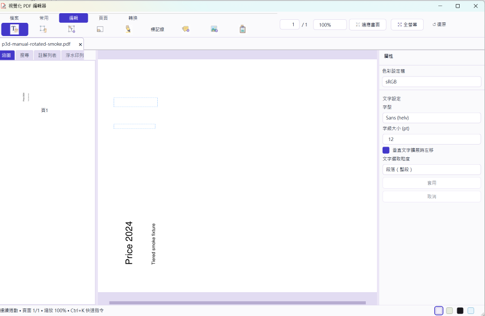
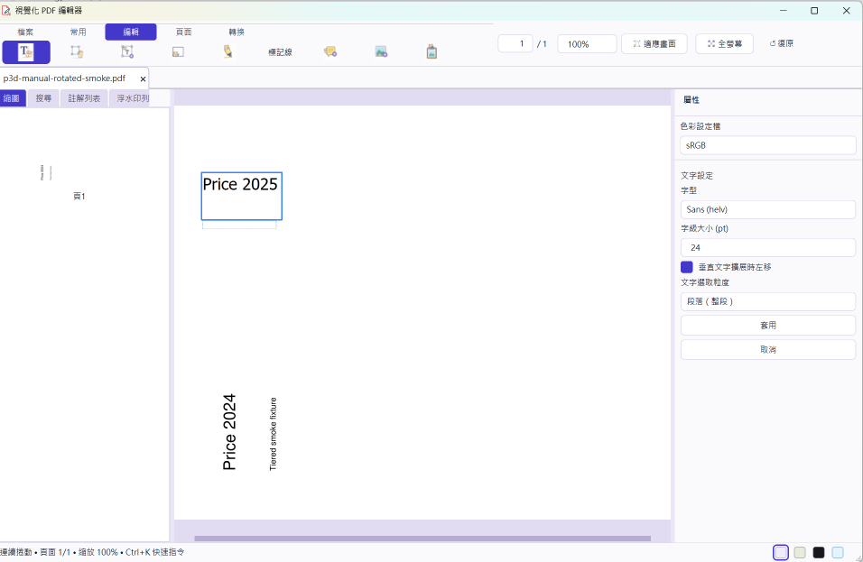
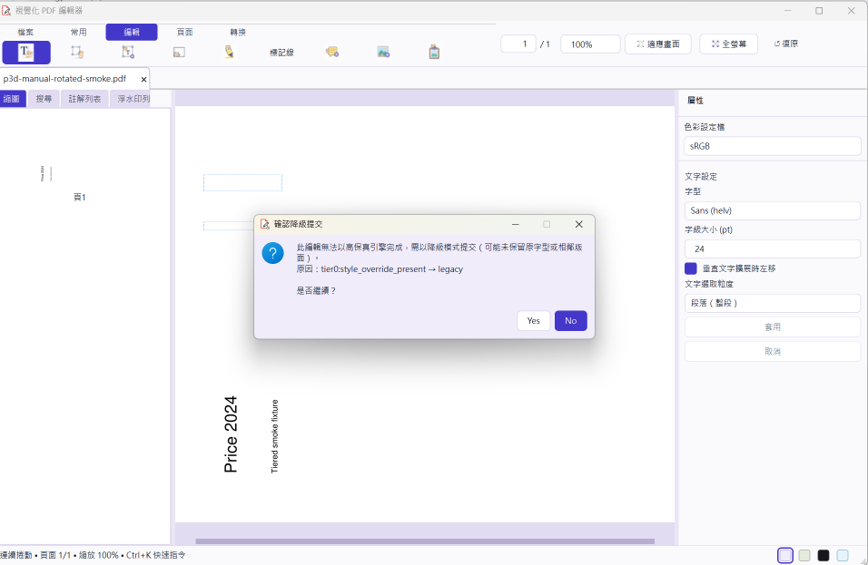

# P3-D rotated inline-edit manual smoke attempt

**Date:** 2026-08-29 14:32 Asia/Taipei  
**Branch:** `task13/p3d-interpretation-reuse`  
**Result:** FAILED -- the resumed interactive smoke reached the App pipeline
and found a rotated-page UI/plan-preview integration failure.

## Required configuration

The requested launch configuration was prepared exactly as follows:

```powershell
$env:TEXT_COMMIT_ENGINE = "tiered"
$env:TEXT_COMMIT_PREVIEW = "plan"
$env:TEXT_COMMIT_MAX_TIER = "1"
& "C:\Users\jiang\Documents\python programs\pdf_editor\.venv\Scripts\python.exe" main.py
```

For the interaction, a disposable one-page fixture was generated at
`tmp/pdfs/p3d-manual-rotated-smoke.pdf`. It contains `Price 2024`, uses a
standard Helvetica `Tj` show, and has `/Rotate 270`. An independent reopen
confirmed:

```text
pages=1 rotation=270 text='Price 2024\nTiered smoke fixture'
```

The fixture and non-sensitive launch capture remain in the ignored `tmp/pdfs/`
workspace for a resumed run; they are not shipped as repository artifacts.

## Initial block

The App launch attempted from this worktree did not create a new primary window:
the single-instance handoff targeted an already-running `\u8996\u89ba\u5316 PDF \u7de8\u8f2f\u5668` process instead. Before a file could be selected, the desktop entered the
Windows lock screen. This environment does not expose a permitted computer-use
control channel to unlock or impersonate the desktop user.

Consequently, the first attempt made none of the acceptance observations below.
That initial result must not be interpreted as a smoke PASS:

- 5--10 plan-preview keystrokes (cold miss followed by warm cache hits);
- rotated preview orientation, clipping, or latest-generation behaviour;
- commit/preview visual parity;
- second edit after a page transition; or
- session/document-close lifecycle behaviour.

## Resumed interactive result

After the Windows desktop was unlocked, the pre-existing blank App instance was
closed and the worktree App was launched with the exact configuration above and
the rotated fixture. This was a real desktop interaction, not a QTest or model
test.

1. The fixture opened and visibly rendered `/Rotate 270` text vertically near
   the lower part of the page.
2. After selecting `Edit > Text edit`, the App drew two editable-region outlines
   horizontally near the top of the page instead of over the visible rotated
   text.
3. Clicking the actual visible `Price 2024` text did **not** open an inline
   editor. Clicking the incorrectly positioned outline did open an editor, but
   it opened at that incorrect top-of-page location. This breaks the basic
   rotated-text interaction before preview parity can be assessed.
4. Five edit-input events were attempted to exercise warm previews. The active
   Chinese IME initially composed non-ASCII input, so it cannot evidence the
   intended ASCII sequence; the final intended value was pasted and displayed
   as `Price 2025`. This does not change the observed geometry failure. The
   preview remained at the same wrong horizontal location while the PDF's
   original vertical `Price 2024` stayed visible below. No Stage-B cache result
   is claimed from this failed interaction.
5. Selecting Apply did not produce a plan-backed commit. The App displayed a
   confirmation dialog that reported `tier0:style_override_present -> legacy`.
   The fallback was explicitly declined, so the fixture was not silently
   committed through the legacy path.
6. The session/App then closed normally without a visible MuPDF exception or
   orphaned-object crash. A second edit cannot meaningfully validate cache reuse
   while the primary rotated hit region and plan path are broken.

Remote-review evidence (cropped to the App window only):







The original full-screen captures remain ignored under `tmp/pdfs/`:

- `p3d-smoke-text-mode-small.png` -- visible vertical text and wrong top-page
  editable outlines;
- `p3d-smoke-overlay-click-small.png` -- editor opened at the wrong outline;
- `p3d-smoke-pasted-small.png` -- `Price 2025` preview at the wrong location;
- `p3d-smoke-after-apply-small.png` -- plan path declined in favour of the
  reported legacy fallback.

This is a reproducible **FAIL**, not an acceptance pass. The root symptom is
consistent with a visual/unrotated page-coordinate mismatch in the GUI text-hit
or editor-placement path; it is not attributed to `PageInterpretation` without
further diagnosis.

## Required retest

Fix and retest the visual-to-page mapping used by the text-edit hit region and
editor placement on `/Rotate 90` and `/Rotate 270`. Then repeat the same
multi-keystroke test and require an actual plan-backed commit (not the legacy
fallback) before marking P3-D's GUI smoke PASS.
