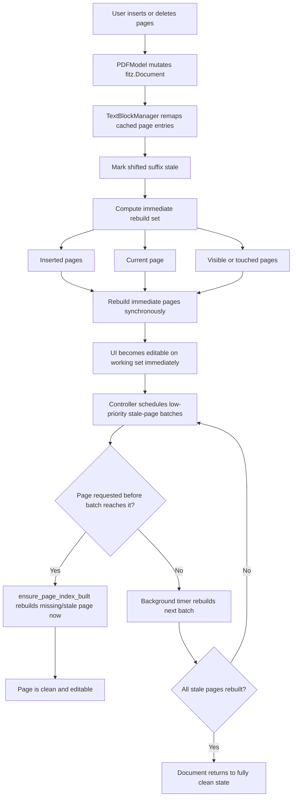

# Hybrid Page Index Remap and Lazy Rebuild Design

## Summary

The PDF editor currently opens documents with deferred batched indexing, but page-structure operations still fall back to `TextBlockManager.build_index(self.doc)`, which rebuilds every page on the main thread. This design replaces that full rebuild path with a hybrid strategy:

1. Remap cached per-page indexes after insert/delete.
2. Rebuild only the pages that must be correct immediately.
3. Mark shifted pages as stale.
4. Reindex stale pages later in small controller-driven batches.

The goal is to keep structural operations responsive on large PDFs without regressing two known requirements:

- large PDFs must remain operable while indexing work is pending
- newly inserted pages must be immediately editable

## Current Behavior

Relevant code paths:

- `model/text_block.py`: `TextBlockManager.build_index()` clears the whole cache and rebuilds every page.
- `model/pdf_model.py`: `delete_pages()`, `insert_blank_page()`, and `insert_pages_from_file()` all call `build_index()` after mutating `self.doc`.
- `model/edit_commands.py`: structural `SnapshotCommand.execute()` and `undo()` restore whole-document snapshots, then call `build_index()`.
- `controller/pdf_controller.py`: open-file indexing is already deferred into `_schedule_index_batch()`, which avoids the old large-PDF stall.

This split behavior means open is optimized, but insert/delete/undo/redo can still block the UI by rebuilding hundreds of pages synchronously.

## Goals

- Keep page insert/delete operations responsive on large documents.
- Preserve full-document correctness after structural changes.
- Guarantee immediate editability for inserted pages and visible/touched pages.
- Reuse the controller's existing batch-and-yield pattern instead of reintroducing long main-thread stalls.
- Keep the design local to the current indexing architecture; do not replace the text extraction model itself.

## Non-Goals

- Replacing `fitz` text extraction.
- Introducing worker threads for page indexing in this change.
- Redesigning search UI beyond exposing partial-progress state if needed.
- Making every shifted page clean synchronously before control returns to the user.

## Design Overview

### 1. Per-page cache states

`TextBlockManager` should track a lifecycle for each page cache entry:

- `missing`: no cache entry exists yet
- `clean`: cache matches the current page content and current page index
- `stale`: cache exists but must be rebuilt before strict use

This supplements the existing dictionaries:

- `_index`
- `_span_index`
- `_paragraph_index`
- `_run_to_paragraph`

with a page-state map such as `_page_state: dict[int, str]`, keyed by the internal zero-based page index already used throughout `TextBlockManager`.

### 2. Structural remap instead of full rebuild

After a structural page operation, unchanged pages should not be discarded. Instead, the manager should remap cached entries by page number.

Required helpers in `TextBlockManager`:

- `drop_pages(page_indices: list[int])`
- `shift_after_insert(insert_at: int, count: int)`
- `shift_after_delete(deleted_pages: list[int])`
- `mark_stale_range(start_idx: int)`
- `_clone_page_entry_with_new_page(old_idx: int, new_idx: int)`

The remap helper must rewrite page-derived metadata, because IDs currently embed zero-based page indexes:

- block ids such as `page_{page_idx}_block_{raw_index}`
- span ids such as `p{page_idx}_b{block_idx}_l{line_idx}_s{span_idx}`
- paragraph ids and `page_num` / `page_idx` fields stored in the cached objects

Unchanged page geometry and text can be reused, but the cached page identity must match the document's new numbering.

### 3. Immediate rebuild set

Some pages must be correct before control returns to the user:

- newly inserted pages
- the current page
- visible pages in the continuous view
- any page explicitly touched by edit or hit-testing immediately after the operation

Those pages should be rebuilt synchronously with `rebuild_page()` after the structural remap is applied.

This preserves the earlier requirement that newly inserted pages are immediately editable.

### 4. Deferred cleanup of shifted suffix

All shifted pages after the operation point should be marked `stale` unless they were already rebuilt synchronously.

The controller should schedule a low-priority post-operation batch job, similar to open-file indexing:

- small batch size
- timer-based yielding
- generation token to cancel stale work when another operation occurs

This reuses the same lesson from the previous large-PDF fix: avoid stacking heavy indexing work in parallel with scene rendering in a way that starves the event loop.

### 5. Stronger `ensure_page_index_built`

`PDFModel.ensure_page_index_built(page_num)` currently rebuilds only when the page is absent from `_index`.

It should rebuild when the page is either:

- `missing`
- `stale`

That guarantees correctness for:

- click hit-testing
- edit target resolution
- any direct model caller that touches a page before the background queue reaches it

### 6. Search behavior

Search should not silently ignore stale pages.

Recommended behavior:

- `SearchTool.search_text()` returns results from clean pages immediately.
- If stale pages remain, the controller marks search as in progress and continues draining stale pages in the background.
- Once all stale pages are clean, search finalizes.

If the UI cannot yet present progressive results cleanly, an acceptable first version is:

- before full-document search, drain stale pages in batches while keeping the UI responsive
- then perform the search once all pages are clean

The key constraint is that search correctness must not depend on stale caches pretending to be final.

### 7. Structural undo/redo

`SnapshotCommand` for structural operations should stop calling `build_index()` after restoring snapshot bytes.

Instead, it should invoke the same structural refresh path used by direct page operations:

- restore document snapshot
- compute affected pages / shifted ranges
- rebuild immediate pages
- mark remainder stale
- request controller-driven background completion

This keeps undo/redo behavior aligned with direct insert/delete behavior.

## Operation Flows

### Insert blank page

1. Mutate `self.doc` with `new_page()`.
2. Shift cached entries at and after `insert_at` upward by one page.
3. Seed or rebuild the inserted page immediately.
4. Mark shifted suffix stale except pages rebuilt in the immediate set.
5. Refresh the visible UI.
6. Schedule background stale-page batches.

### Insert pages from file

1. Mutate `self.doc` with `insert_pdf()`.
2. Shift cached entries after `insert_at` upward by `count`.
3. Build each inserted page immediately.
4. Mark shifted suffix stale except pages rebuilt in the immediate set.
5. Refresh the visible UI.
6. Schedule background stale-page batches.

### Delete pages

1. Mutate `self.doc` with `delete_page()`.
2. Drop removed cached page entries.
3. Shift later cached entries downward.
4. Rebuild current/visible pages immediately if they were shifted into view.
5. Mark the shifted suffix stale.
6. Refresh the visible UI.
7. Schedule background stale-page batches.

## Workflow Graph

## Invariants

- A page passed to edit hit-testing must be clean before use.
- Newly inserted pages are rebuilt synchronously before returning to the controller.
- Structural operations never call full-document `build_index()` on the hot path.
- Background stale-page jobs are cancelable and generation-scoped.
- Search never reports final full-document results while stale pages remain unsearched.

## Risks and Mitigations

### Risk: stale IDs point to the wrong page

Mitigation:

- centralize ID/page-number rewrite in one helper
- add tests that inspect `block_id`, `span_id`, and `paragraph_id` after insert/delete

### Risk: background work regresses UI responsiveness

Mitigation:

- reuse small timer batches
- run only one structural reindex queue per session
- cancel old generations when a new structural operation occurs

### Risk: search returns incomplete results

Mitigation:

- track whether stale pages remain
- expose a "search pending" state or delay final-result presentation until stale pages are drained

### Risk: undo/redo diverges from direct operation path

Mitigation:

- route both through one shared structural refresh helper in `PDFModel`

## Testing Strategy

Add regression coverage for:

- insert blank page: inserted page immediately editable
- insert pages from file: inserted imported pages immediately indexed
- delete pages: shifted pages are rebuilt on demand and IDs reflect new page numbers
- structural undo/redo: no full rebuild call on the hot path, pages become clean lazily
- search after structural operations: complete results after stale pages are drained
- controller scheduling: post-operation reindex batches are generation-scoped and yield

## Recommended Implementation Order

1. Add state/remap support to `TextBlockManager`.
2. Update `PDFModel` structural page operations and `ensure_page_index_built()`.
3. Update structural `SnapshotCommand` to use the same refresh path.
4. Add controller scheduling for structural stale-page batches.
5. Update search behavior and regression tests.
